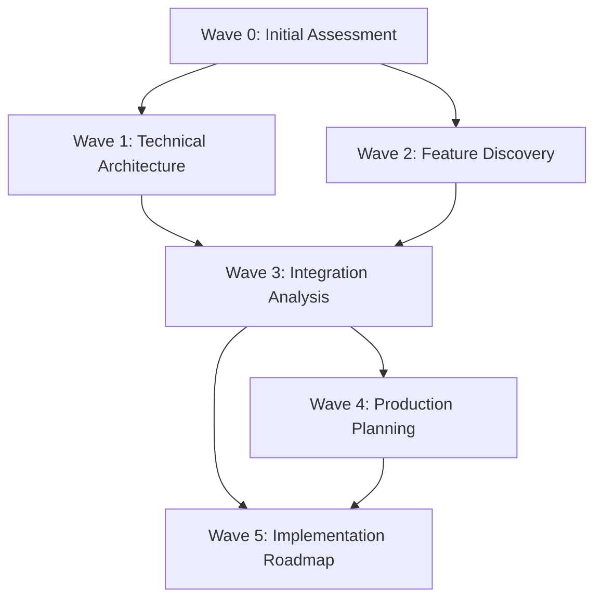

# SMS Project Planning Strategy

**Created Date**: 2025-07-05
**Created By**: Planning Strategist Agent
**Purpose**: Define optimal wave-based planning approach for comprehensive SMS project analysis

## Executive Summary

Based on Wave-0 findings, the SMS project requires a **5-wave planning strategy** to comprehensively analyze and document all features, design decisions, and integration requirements. The project's complexity (two separate portals at ~85% completion) demands specialized teams focusing on different aspects.

### Key Planning Principles
1. **Parallel Analysis**: Multiple agents working simultaneously on different aspects
2. **Deep Discovery**: Find EVERY feature, including latest backup discoveries
3. **Integration Focus**: Special attention to portal connection points
4. **Revenue Protection**: Careful analysis of hidden markup systems
5. **Production Readiness**: Security, scalability, and deployment planning

## Recommended Wave Structure

### Wave 1: Technical Architecture Deep Dive (2 days)
**Focus**: Complete technical understanding of both portals

**Team Composition**:
- **Lead**: Senior Architect Agent
- **Members**:
  - Frontend Specialist Agent (React/TypeScript expert)
  - Backend Specialist Agent (Node.js/PostgreSQL expert)
  - DevOps Specialist Agent (Deployment/Infrastructure)
  - Security Analyst Agent

**Deliverables**:
1. Complete architecture diagrams for both portals
2. Technology stack analysis with version details
3. Database schema documentation
4. API endpoint inventory
5. Security vulnerability assessment
6. Infrastructure requirements document
7. Performance baseline metrics

**Special Focus Areas**:
- Latest architectural decisions in backups
- Shadow clone deployment strategy
- Offline-first implementation details
- Multi-tenant isolation mechanisms

### Wave 2: Feature Discovery & Business Logic (2 days)
**Focus**: Document EVERY feature and business rule

**Team Composition**:
- **Lead**: Business Analyst Agent
- **Members**:
  - Feature Discovery Agent
  - Revenue Analyst Agent (parts markup specialist)
  - Workflow Specialist Agent
  - UI/UX Analyst Agent

**Deliverables**:
1. Complete feature inventory with screenshots
2. Business logic documentation
3. Revenue model deep dive (especially hidden markup)
4. User journey maps for all roles
5. Workflow diagrams
6. UI component library
7. Missing feature gap analysis

**Special Focus Areas**:
- Parts markup implementation (20% hidden revenue)
- Critical parts intelligence system
- Handover enforcement logic
- Quality scoring algorithms
- Latest feature additions from backups

### Wave 3: Integration & Data Flow Analysis (2 days)
**Focus**: Portal integration requirements and data synchronization

**Team Composition**:
- **Lead**: Integration Architect Agent
- **Members**:
  - API Specialist Agent
  - Data Migration Expert Agent
  - Testing Specialist Agent
  - Documentation Agent

**Deliverables**:
1. Integration architecture blueprint
2. API specification documents
3. Data flow diagrams
4. Migration strategy (SQLite → PostgreSQL)
5. Test plan for integration
6. Webhook implementation guide
7. Authentication synchronization plan

**Special Focus Areas**:
- Token-based integration between portals
- User provisioning across systems
- Parts intelligence sharing
- File storage unification (S3)
- Real-time progress tracking

### Wave 4: Production & Deployment Planning (1 day)
**Focus**: Production readiness and deployment strategy

**Team Composition**:
- **Lead**: DevOps Lead Agent
- **Members**:
  - Cloud Architect Agent
  - Security Compliance Agent
  - Performance Engineer Agent
  - Monitoring Specialist Agent

**Deliverables**:
1. Production deployment plan
2. Infrastructure as Code templates
3. Security hardening checklist
4. Performance optimization guide
5. Monitoring and alerting setup
6. Disaster recovery plan
7. Compliance documentation (IMO 2021, IACS)

**Special Focus Areas**:
- Maritime industry compliance
- Multi-region deployment
- Offline-capable infrastructure
- Cost optimization strategies
- Latest deployment innovations

### Wave 5: Implementation Roadmap & Risk Mitigation (1 day)
**Focus**: Actionable plan for completing the project

**Team Composition**:
- **Lead**: Project Manager Agent
- **Members**:
  - Risk Analyst Agent
  - Timeline Specialist Agent
  - Resource Planner Agent
  - Quality Assurance Lead Agent

**Deliverables**:
1. Detailed implementation roadmap
2. Risk mitigation strategies
3. Resource allocation plan
4. Timeline with milestones
5. Quality assurance framework
6. Success metrics definition
7. Post-launch support plan

**Special Focus Areas**:
- Integration complexity management
- User adoption strategies
- Revenue protection measures
- Competitive advantage maintenance

## Dependencies Between Waves

### Critical Dependencies
1. **Wave 1 → Wave 3**: Architecture understanding required for integration
2. **Wave 2 → Wave 3**: Feature knowledge needed for data flow design
3. **Wave 3 → Wave 4**: Integration requirements drive infrastructure needs
4. **Wave 3 → Wave 5**: Integration complexity affects timeline
5. **Wave 4 → Wave 5**: Infrastructure constraints impact implementation

## Success Criteria

### Overall Project Success
- 100% feature documentation coverage
- All design decisions captured and justified
- Complete integration blueprint ready for implementation
- Production-ready deployment plan
- Risk mitigation for all high-priority issues
- Clear 8-12 week roadmap to production

### Per-Wave Success Metrics

**Wave 1 Success**:
- All code repositories analyzed
- Database schemas fully documented
- Security vulnerabilities identified
- Performance baselines established

**Wave 2 Success**:
- Every UI screen documented
- All business rules captured
- Revenue model fully understood
- User workflows mapped

**Wave 3 Success**:
- Integration APIs specified
- Data migration plan validated
- Test scenarios defined
- Authentication strategy finalized

**Wave 4 Success**:
- Infrastructure costs calculated
- Compliance requirements met
- Monitoring strategy defined
- Deployment automation ready

**Wave 5 Success**:
- Realistic timeline created
- Resources properly allocated
- Risks identified and mitigated
- Clear go-to-market strategy

## Special Considerations

### Latest Backup Discoveries
Each wave must specifically search for and document:
- Recent architectural decisions
- Last-minute feature additions
- Updated business requirements
- Modified deployment strategies
- Emergency fixes or workarounds

### Revenue Protection
Special care around documenting:
- Parts markup implementation (keep confidential)
- Hidden revenue streams
- Pricing strategies
- Competitive advantages
- Business intelligence features

### Integration Complexity
Given the two-portal architecture:
- Assume nothing about compatibility
- Document all assumptions
- Plan for data transformation
- Consider fallback strategies
- Test edge cases thoroughly

## Resource Requirements

### Human Resources
- **Total Agents Needed**: 20-25 specialized agents
- **Coordination**: 1 Wave Coordinator per wave
- **Review**: 1 Quality Reviewer per wave
- **Duration**: 8 days total (with parallel execution)

### Technical Resources
- Access to all code repositories
- Database access (read-only)
- Documentation repositories
- Backup locations
- Development environment access

### Time Allocation
- **Wave 1**: 2 days (parallel with Wave 2)
- **Wave 2**: 2 days (parallel with Wave 1)
- **Wave 3**: 2 days (depends on 1 & 2)
- **Wave 4**: 1 day (parallel with Wave 5)
- **Wave 5**: 1 day (parallel with Wave 4)
- **Total Duration**: 5-6 days with parallelization

## Risk Factors

### High Risks
1. **Missing Critical Information**: Backups might contain undiscovered features
2. **Integration Complexity**: Two systems with different architectures
3. **Revenue Model Exposure**: Must keep markup strategy confidential
4. **Time Pressure**: 8-12 week production timeline is aggressive

### Mitigation Strategies
1. **Comprehensive Search**: Each wave includes backup discovery tasks
2. **Integration Experts**: Dedicated team for integration analysis
3. **Confidentiality Protocols**: Revenue information marked sensitive
4. **Parallel Execution**: Reduce timeline through parallelization

## Conclusion

This 5-wave planning strategy provides comprehensive coverage of the SMS project while maintaining focus on critical areas:
- Technical excellence through deep architecture analysis
- Business value through complete feature documentation
- Integration success through dedicated analysis
- Production readiness through careful planning
- Implementation clarity through detailed roadmapping

The parallel execution model allows completion within 5-6 days while ensuring no aspect is overlooked. Special attention to latest discoveries and revenue protection ensures the analysis captures the full project value.

**Next Step**: Execute Wave Plan with assigned agent teams

---
*This strategy document guides the comprehensive analysis of the SMS project to ensure every feature, decision, and requirement is documented for successful production deployment.*