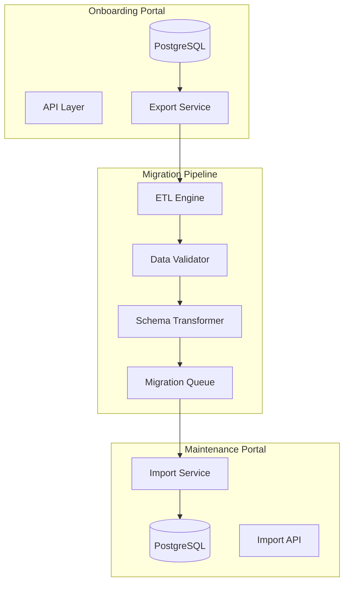

# SMS Data Migration Strategy: Onboarding to Maintenance Portal

## Executive Summary

This document outlines the comprehensive data migration strategy for transferring vessel onboarding data from the Onboarding Portal (PostgreSQL) to the Maintenance Portal (SQLite → PostgreSQL). The strategy ensures data integrity, handles schema differences, and provides mechanisms for incremental synchronization.

## Migration Architecture Overview



## Schema Mapping

### Core Entity Mappings

#### 1. Company Mapping
```sql
-- Onboarding Portal (PostgreSQL)
companies {
    id: UUID
    name: VARCHAR(255)
    code: VARCHAR(50) UNIQUE
    contact_email: VARCHAR(255)
    contact_phone: VARCHAR(50)
    timezone: VARCHAR(50)
    settings: JSON
    is_active: BOOLEAN
}

-- Maintenance Portal (SQLite/PostgreSQL)
companies {
    id: INTEGER/UUID (migration: generate new UUID)
    name: TEXT/VARCHAR(255)
    slug: TEXT/VARCHAR(50) UNIQUE (map from: code)
    logo_url: TEXT (derive from settings or default)
    primary_color: TEXT (from settings or '#0066CC')
    secondary_color: TEXT (from settings or '#E6F2FF')
    -- contact fields moved to company_settings table
}

-- Transformation Rules
TRANSFORM company {
    id: generateUUID()
    name: source.name
    slug: source.code.toLowerCase().replace(/[^a-z0-9]/g, '-')
    logo_url: source.settings?.branding?.logo || '/assets/logos/default.svg'
    primary_color: source.settings?.branding?.primaryColor || '#0066CC'
    secondary_color: source.settings?.branding?.secondaryColor || '#E6F2FF'
    
    -- Store additional data
    company_settings: {
        contact_email: source.contact_email
        contact_phone: source.contact_phone
        timezone: source.timezone
        original_settings: source.settings
    }
}
```

#### 2. User Mapping
```sql
-- Onboarding Portal
users {
    id: UUID
    company_id: UUID
    email: VARCHAR(255)
    password_hash: VARCHAR(255)
    first_name: VARCHAR(100)
    last_name: VARCHAR(100)
    role: UserRole (ENUM)
    phone: VARCHAR(50)
    avatar_url: TEXT
    is_active: BOOLEAN
    settings: JSON
}

-- Maintenance Portal
users {
    id: INTEGER/UUID
    company_id: INTEGER/UUID
    email: TEXT
    password_hash: TEXT
    first_name: TEXT
    last_name: TEXT
    role: TEXT CHECK IN ('technician', 'manager', 'admin')
    avatar_url: TEXT
    is_active: BOOLEAN
}

-- Role Mapping
ROLE_MAP = {
    'SUPER_ADMIN': 'admin',
    'ADMIN': 'admin',
    'MANAGER': 'manager',
    'TECHNICIAN': 'technician',
    'HSE_OFFICER': 'technician', -- with metadata flag
    'VIEWER': 'technician' -- limited permissions
}

TRANSFORM user {
    id: generateUUID()
    company_id: mapCompanyId(source.company_id)
    email: source.email
    password_hash: source.password_hash
    first_name: source.first_name
    last_name: source.last_name
    role: ROLE_MAP[source.role]
    avatar_url: source.avatar_url
    is_active: source.is_active
    
    -- Store original role for permissions
    user_metadata: {
        original_role: source.role
        phone: source.phone
        settings: source.settings
    }
}
```

#### 3. Vessel Mapping
```sql
-- Onboarding Portal
vessels {
    id: UUID
    company_id: UUID
    name: VARCHAR(255)
    imo_number: VARCHAR(20) UNIQUE
    vessel_type: VARCHAR(100)
    flag: VARCHAR(100)
    gross_tonnage: DECIMAL(10,2)
    year_built: INTEGER
    class_society: VARCHAR(100)
    onboarding_status: OnboardingStatus
    metadata: JSON
}

-- Maintenance Portal
vessels {
    id: INTEGER/UUID
    company_id: INTEGER/UUID
    name: TEXT
    imo_number: TEXT UNIQUE
    vessel_type: TEXT
    image_url: TEXT
    status: TEXT DEFAULT 'operational'
}

TRANSFORM vessel {
    id: generateUUID()
    company_id: mapCompanyId(source.company_id)
    name: source.name
    imo_number: source.imo_number
    vessel_type: source.vessel_type
    image_url: source.metadata?.image_url || '/assets/vessels/default.svg'
    status: mapVesselStatus(source.onboarding_status)
    
    -- Extended vessel data
    vessel_details: {
        flag: source.flag
        gross_tonnage: source.gross_tonnage
        year_built: source.year_built
        class_society: source.class_society
        metadata: source.metadata
    }
}
```

#### 4. Equipment Mapping (Most Complex)
```sql
-- Onboarding Portal
equipment {
    id: UUID
    vessel_id: UUID
    location_id: UUID
    name: VARCHAR(255)
    code: VARCHAR(100)
    equipment_type: VARCHAR(100)
    manufacturer: VARCHAR(255)
    model: VARCHAR(255)
    serial_number: VARCHAR(255)
    criticality: EquipmentCriticality
    status: EquipmentStatus
    classification: EquipmentClassification
    installation_date: DATE
    warranty_expiry: DATE
    specifications: JSON
    maintenance_interval_days: INTEGER
    quality_score: INTEGER
    notes: TEXT
    metadata: JSON
}

-- Maintenance Portal
equipment {
    id: INTEGER/UUID
    vessel_id: INTEGER/UUID
    qr_code: TEXT UNIQUE (generate from code)
    name: TEXT
    manufacturer: TEXT
    model: TEXT
    serial_number: TEXT
    location: TEXT (flatten from location hierarchy)
    equipment_type: TEXT
    status: TEXT CHECK IN (...)
    installation_date: DATE
    last_maintenance_date: DATE
    next_maintenance_date: DATE
    specifications: JSON
}

TRANSFORM equipment {
    id: generateUUID()
    vessel_id: mapVesselId(source.vessel_id)
    qr_code: source.code || '-' || generateHash(source.id, 6)
    name: source.name
    manufacturer: source.manufacturer
    model: source.model
    serial_number: source.serial_number
    location: await resolveLocationPath(source.location_id)
    equipment_type: source.equipment_type
    status: mapEquipmentStatus(source.status)
    installation_date: source.installation_date
    last_maintenance_date: source.metadata?.last_maintenance_date
    next_maintenance_date: calculateNextMaintenance(source)
    specifications: mergeSpecifications(source)
    
    -- Additional tables for complex data
    equipment_metadata: {
        original_id: source.id
        criticality: source.criticality
        classification: source.classification
        quality_score: source.quality_score
        warranty_expiry: source.warranty_expiry
        notes: source.notes
        original_metadata: source.metadata
    }
}
```

### Supporting Entity Mappings

#### 5. Location Hierarchy Resolution
```javascript
async function resolveLocationPath(locationId) {
    const location = await getLocation(locationId);
    const path = [];
    
    let current = location;
    while (current) {
        path.unshift(current.name);
        current = current.parent_id ? await getLocation(current.parent_id) : null;
    }
    
    return path.join(' > '); // e.g., "Engine Room > Starboard > Main Panel"
}
```

#### 6. Critical Parts Migration
```sql
-- Onboarding Portal
critical_parts {
    id: UUID
    equipment_id: UUID
    name: VARCHAR(255)
    part_number: VARCHAR(255)
    manufacturer: VARCHAR(255)
    criticality: EquipmentCriticality
    quantity: INTEGER
    minimum_stock: INTEGER
    current_stock: INTEGER
}

-- Maintenance Portal (New table to create)
critical_parts {
    id: UUID
    equipment_id: UUID
    part_number: VARCHAR(100)
    description: TEXT
    causes_failure: BOOLEAN
    current_stock: INTEGER
    minimum_stock: INTEGER
}

TRANSFORM critical_part {
    id: generateUUID()
    equipment_id: mapEquipmentId(source.equipment_id)
    part_number: source.part_number
    description: source.name
    causes_failure: source.criticality === 'CRITICAL'
    current_stock: source.current_stock
    minimum_stock: source.minimum_stock
    
    part_details: {
        manufacturer: source.manufacturer
        quantity_per_equipment: source.quantity
        original_criticality: source.criticality
    }
}
```

#### 7. Document Migration
```sql
-- Onboarding Portal
documents {
    id: UUID
    vessel_id: UUID
    equipment_id: UUID
    document_type: DocumentType
    name: VARCHAR(255)
    file_path: TEXT (S3 URL)
    file_size: BIGINT
    mime_type: VARCHAR(100)
}

-- Maintenance Portal
equipment_documents {
    id: INTEGER/UUID
    equipment_id: INTEGER/UUID
    document_type: TEXT CHECK IN (...)
    file_name: TEXT
    file_path: TEXT
    file_size: INTEGER
}

TRANSFORM document {
    id: generateUUID()
    equipment_id: mapEquipmentId(source.equipment_id)
    document_type: mapDocumentType(source.document_type)
    file_name: source.name
    file_path: source.file_path // Keep S3 URLs
    file_size: source.file_size
    
    -- Track vessel-level documents separately
    IF (!source.equipment_id) {
        vessel_documents: {
            vessel_id: source.vessel_id
            document_id: id
        }
    }
}
```

## ETL Pipeline Design

### 1. Extract Phase
```javascript
class OnboardingDataExtractor {
    async extractVesselData(vesselId, options = {}) {
        const extraction = {
            vessel: await this.getVessel(vesselId),
            locations: await this.getLocations(vesselId),
            equipment: await this.getEquipment(vesselId, options),
            criticalParts: await this.getCriticalParts(vesselId),
            documents: await this.getDocuments(vesselId),
            qualityScores: await this.getQualityScores(vesselId),
            crossReferences: await this.getCrossReferences(vesselId)
        };
        
        // Add metadata
        extraction.metadata = {
            extractedAt: new Date(),
            vesselId: vesselId,
            recordCounts: {
                locations: extraction.locations.length,
                equipment: extraction.equipment.length,
                criticalParts: extraction.criticalParts.length,
                documents: extraction.documents.length
            }
        };
        
        return extraction;
    }
    
    async getEquipment(vesselId, { batchSize = 100 } = {}) {
        const equipment = [];
        let offset = 0;
        
        while (true) {
            const batch = await db.equipment.findMany({
                where: { vessel_id: vesselId },
                include: {
                    location: true,
                    documents: true,
                    criticalParts: true
                },
                take: batchSize,
                skip: offset
            });
            
            if (batch.length === 0) break;
            
            equipment.push(...batch);
            offset += batchSize;
            
            // Progress callback
            if (this.onProgress) {
                this.onProgress({
                    phase: 'extract',
                    entity: 'equipment',
                    processed: equipment.length
                });
            }
        }
        
        return equipment;
    }
}
```

### 2. Transform Phase
```javascript
class DataTransformer {
    constructor(mappingRules) {
        this.mappingRules = mappingRules;
        this.idMappings = new Map(); // Track ID transformations
    }
    
    async transformVesselData(extractedData) {
        const transformed = {
            company: await this.transformCompany(extractedData.vessel.company),
            vessel: await this.transformVessel(extractedData.vessel),
            users: await this.transformUsers(extractedData.vessel.company.users),
            equipment: [],
            criticalParts: [],
            documents: []
        };
        
        // Transform equipment with location resolution
        for (const equip of extractedData.equipment) {
            const locationPath = await this.resolveLocationPath(
                equip.location_id,
                extractedData.locations
            );
            
            const transformedEquip = await this.transformEquipment(equip, locationPath);
            transformed.equipment.push(transformedEquip);
            
            // Track ID mapping for related entities
            this.idMappings.set(equip.id, transformedEquip.id);
        }
        
        // Transform related entities using ID mappings
        transformed.criticalParts = await this.transformCriticalParts(
            extractedData.criticalParts
        );
        
        transformed.documents = await this.transformDocuments(
            extractedData.documents
        );
        
        // Add cross-reference data
        transformed.crossReferences = await this.transformCrossReferences(
            extractedData.crossReferences
        );
        
        return transformed;
    }
    
    async transformEquipment(source, locationPath) {
        return {
            id: uuidv4(),
            vessel_id: this.idMappings.get(source.vessel_id),
            qr_code: this.generateQRCode(source),
            name: source.name,
            manufacturer: source.manufacturer,
            model: source.model,
            serial_number: source.serial_number,
            location: locationPath,
            equipment_type: source.equipment_type,
            status: this.mapEquipmentStatus(source.status),
            installation_date: source.installation_date,
            last_maintenance_date: source.metadata?.last_maintenance_date,
            next_maintenance_date: this.calculateNextMaintenance(source),
            specifications: this.mergeSpecifications(source),
            
            // Metadata for extended info
            _metadata: {
                original_id: source.id,
                criticality: source.criticality,
                classification: source.classification,
                quality_score: source.quality_score,
                warranty_expiry: source.warranty_expiry,
                notes: source.notes,
                verification_data: {
                    last_verified_at: source.last_verified_at,
                    next_verification_date: source.next_verification_date,
                    verified_by: source.verified_by
                }
            }
        };
    }
    
    mapEquipmentStatus(onboardingStatus) {
        const statusMap = {
            'ACTIVE': 'operational',
            'VERIFIED': 'operational',
            'APPROVED': 'operational',
            'REVIEWED': 'operational',
            'DRAFT': 'maintenance',
            'REMOVED': 'decommissioned',
            'DELETED': 'decommissioned'
        };
        
        return statusMap[onboardingStatus] || 'operational';
    }
}
```

### 3. Load Phase
```javascript
class MaintenancePortalLoader {
    constructor(targetDb) {
        this.db = targetDb;
        this.batchSize = 100;
        this.transactionLog = [];
    }
    
    async loadVesselData(transformedData) {
        const transaction = await this.db.transaction();
        
        try {
            // Load in dependency order
            const companyId = await this.loadCompany(transformedData.company, transaction);
            const vesselId = await this.loadVessel(transformedData.vessel, companyId, transaction);
            const userIds = await this.loadUsers(transformedData.users, companyId, transaction);
            
            // Load equipment in batches
            const equipmentIds = await this.loadEquipmentBatch(
                transformedData.equipment, 
                vesselId, 
                transaction
            );
            
            // Load related data
            await this.loadCriticalParts(transformedData.criticalParts, equipmentIds, transaction);
            await this.loadDocuments(transformedData.documents, equipmentIds, transaction);
            await this.loadCrossReferences(transformedData.crossReferences, transaction);
            
            // Commit transaction
            await transaction.commit();
            
            // Log successful migration
            await this.logMigration({
                status: 'success',
                vesselId: vesselId,
                recordCounts: {
                    equipment: equipmentIds.length,
                    criticalParts: transformedData.criticalParts.length,
                    documents: transformedData.documents.length
                },
                timestamp: new Date()
            });
            
            return { success: true, vesselId };
            
        } catch (error) {
            await transaction.rollback();
            
            // Log failed migration
            await this.logMigration({
                status: 'failed',
                error: error.message,
                vesselData: transformedData.vessel,
                timestamp: new Date()
            });
            
            throw error;
        }
    }
    
    async loadEquipmentBatch(equipment, vesselId, transaction) {
        const equipmentIds = new Map();
        
        for (let i = 0; i < equipment.length; i += this.batchSize) {
            const batch = equipment.slice(i, i + this.batchSize);
            
            const insertPromises = batch.map(async (equip) => {
                // Insert main equipment record
                const result = await transaction.query(
                    `INSERT INTO equipment (
                        vessel_id, qr_code, name, manufacturer, model,
                        serial_number, location, equipment_type, status,
                        installation_date, last_maintenance_date,
                        next_maintenance_date, specifications
                    ) VALUES ($1, $2, $3, $4, $5, $6, $7, $8, $9, $10, $11, $12, $13)
                    RETURNING id`,
                    [
                        vesselId, equip.qr_code, equip.name, equip.manufacturer,
                        equip.model, equip.serial_number, equip.location,
                        equip.equipment_type, equip.status, equip.installation_date,
                        equip.last_maintenance_date, equip.next_maintenance_date,
                        JSON.stringify(equip.specifications)
                    ]
                );
                
                const newId = result.rows[0].id;
                equipmentIds.set(equip._metadata.original_id, newId);
                
                // Insert metadata
                await transaction.query(
                    `INSERT INTO equipment_metadata (
                        equipment_id, original_id, criticality, quality_score, metadata
                    ) VALUES ($1, $2, $3, $4, $5)`,
                    [newId, equip._metadata.original_id, equip._metadata.criticality,
                     equip._metadata.quality_score, JSON.stringify(equip._metadata)]
                );
                
                return newId;
            });
            
            await Promise.all(insertPromises);
            
            // Progress update
            if (this.onProgress) {
                this.onProgress({
                    phase: 'load',
                    entity: 'equipment',
                    processed: i + batch.length,
                    total: equipment.length
                });
            }
        }
        
        return equipmentIds;
    }
}
```

## Data Validation

### Pre-Migration Validation
```javascript
class MigrationValidator {
    async validateSourceData(extractedData) {
        const validationResults = {
            errors: [],
            warnings: [],
            stats: {}
        };
        
        // Check data completeness
        this.validateCompleteness(extractedData, validationResults);
        
        // Check data integrity
        await this.validateIntegrity(extractedData, validationResults);
        
        // Check business rules
        this.validateBusinessRules(extractedData, validationResults);
        
        // Check for conflicts
        await this.validateNoConflicts(extractedData, validationResults);
        
        return validationResults;
    }
    
    validateCompleteness(data, results) {
        // Check required fields
        data.equipment.forEach((equip, index) => {
            if (!equip.name) {
                results.errors.push({
                    entity: 'equipment',
                    index: index,
                    field: 'name',
                    message: 'Equipment name is required'
                });
            }
            
            if (!equip.location_id) {
                results.warnings.push({
                    entity: 'equipment',
                    index: index,
                    field: 'location_id',
                    message: 'Equipment has no location'
                });
            }
        });
        
        // Statistics
        results.stats.totalEquipment = data.equipment.length;
        results.stats.equipmentWithoutLocation = data.equipment.filter(e => !e.location_id).length;
        results.stats.criticalEquipment = data.equipment.filter(e => e.criticality === 'CRITICAL').length;
    }
    
    async validateIntegrity(data, results) {
        // Check foreign key relationships
        const locationIds = new Set(data.locations.map(l => l.id));
        
        data.equipment.forEach((equip, index) => {
            if (equip.location_id && !locationIds.has(equip.location_id)) {
                results.errors.push({
                    entity: 'equipment',
                    index: index,
                    field: 'location_id',
                    message: `Invalid location reference: ${equip.location_id}`
                });
            }
        });
        
        // Check for orphaned records
        const equipmentIds = new Set(data.equipment.map(e => e.id));
        
        data.criticalParts.forEach((part, index) => {
            if (!equipmentIds.has(part.equipment_id)) {
                results.warnings.push({
                    entity: 'critical_parts',
                    index: index,
                    message: `Orphaned critical part: ${part.part_number}`
                });
            }
        });
    }
    
    async validateNoConflicts(data, results) {
        // Check for existing data in target
        const existingVessel = await this.targetDb.query(
            'SELECT id FROM vessels WHERE imo_number = $1',
            [data.vessel.imo_number]
        );
        
        if (existingVessel.rows.length > 0) {
            results.warnings.push({
                entity: 'vessel',
                message: `Vessel with IMO ${data.vessel.imo_number} already exists`,
                action: 'Will update existing vessel'
            });
        }
    }
}
```

### Post-Migration Validation
```javascript
class PostMigrationValidator {
    async validateMigration(sourceData, targetVesselId) {
        const validationReport = {
            timestamp: new Date(),
            sourceVesselId: sourceData.vessel.id,
            targetVesselId: targetVesselId,
            checks: []
        };
        
        // Count validation
        await this.validateRecordCounts(sourceData, targetVesselId, validationReport);
        
        // Data integrity validation
        await this.validateDataIntegrity(sourceData, targetVesselId, validationReport);
        
        // Business rule validation
        await this.validateBusinessRules(targetVesselId, validationReport);
        
        // Generate summary
        validationReport.summary = {
            passed: validationReport.checks.filter(c => c.status === 'passed').length,
            failed: validationReport.checks.filter(c => c.status === 'failed').length,
            warnings: validationReport.checks.filter(c => c.status === 'warning').length
        };
        
        return validationReport;
    }
    
    async validateRecordCounts(sourceData, targetVesselId, report) {
        // Equipment count
        const targetEquipmentCount = await this.targetDb.query(
            'SELECT COUNT(*) as count FROM equipment WHERE vessel_id = $1',
            [targetVesselId]
        );
        
        report.checks.push({
            name: 'Equipment Count',
            expected: sourceData.equipment.length,
            actual: parseInt(targetEquipmentCount.rows[0].count),
            status: sourceData.equipment.length === parseInt(targetEquipmentCount.rows[0].count) 
                ? 'passed' : 'failed'
        });
        
        // Critical parts count
        const targetPartsCount = await this.targetDb.query(
            `SELECT COUNT(*) as count FROM critical_parts cp
             JOIN equipment e ON cp.equipment_id = e.id
             WHERE e.vessel_id = $1`,
            [targetVesselId]
        );
        
        report.checks.push({
            name: 'Critical Parts Count',
            expected: sourceData.criticalParts.length,
            actual: parseInt(targetPartsCount.rows[0].count),
            status: sourceData.criticalParts.length === parseInt(targetPartsCount.rows[0].count)
                ? 'passed' : 'warning' // Warning because some parts might be filtered
        });
    }
}
```

## Incremental Sync Design

### Change Detection
```javascript
class ChangeDetector {
    constructor(sourceDb, targetDb) {
        this.sourceDb = sourceDb;
        this.targetDb = targetDb;
    }
    
    async detectChanges(vesselId, lastSyncTimestamp) {
        const changes = {
            created: [],
            updated: [],
            deleted: []
        };
        
        // Find new equipment
        const newEquipment = await this.sourceDb.equipment.findMany({
            where: {
                vessel_id: vesselId,
                created_at: { gt: lastSyncTimestamp }
            }
        });
        changes.created.push(...newEquipment.map(e => ({ type: 'equipment', data: e })));
        
        // Find updated equipment
        const updatedEquipment = await this.sourceDb.equipment.findMany({
            where: {
                vessel_id: vesselId,
                updated_at: { gt: lastSyncTimestamp },
                created_at: { lte: lastSyncTimestamp }
            }
        });
        changes.updated.push(...updatedEquipment.map(e => ({ type: 'equipment', data: e })));
        
        // Find deleted equipment (requires tracking)
        const deletions = await this.sourceDb.auditLog.findMany({
            where: {
                entity_type: 'equipment',
                action: 'DELETE',
                created_at: { gt: lastSyncTimestamp }
            }
        });
        changes.deleted.push(...deletions.map(d => ({ 
            type: 'equipment', 
            id: d.entity_id,
            deleted_at: d.created_at 
        })));
        
        return changes;
    }
}
```

### Incremental Sync Engine
```javascript
class IncrementalSyncEngine {
    constructor(config) {
        this.config = config;
        this.changeDetector = new ChangeDetector(config.sourceDb, config.targetDb);
        this.conflictResolver = new ConflictResolver(config.conflictStrategy);
    }
    
    async syncVessel(vesselId) {
        // Get last sync timestamp
        const lastSync = await this.getLastSync(vesselId);
        
        // Detect changes
        const changes = await this.changeDetector.detectChanges(
            vesselId, 
            lastSync?.timestamp || new Date(0)
        );
        
        // Process changes
        const syncResults = {
            vesselId: vesselId,
            startTime: new Date(),
            created: 0,
            updated: 0,
            deleted: 0,
            conflicts: []
        };
        
        // Apply creates
        for (const creation of changes.created) {
            try {
                await this.applyCreation(creation);
                syncResults.created++;
            } catch (error) {
                syncResults.conflicts.push({
                    type: 'create',
                    entity: creation.type,
                    error: error.message
                });
            }
        }
        
        // Apply updates with conflict resolution
        for (const update of changes.updated) {
            try {
                const conflict = await this.detectConflict(update);
                if (conflict) {
                    const resolution = await this.conflictResolver.resolve(conflict, update);
                    await this.applyUpdate(resolution);
                    syncResults.conflicts.push({
                        type: 'update',
                        entity: update.type,
                        resolved: true,
                        strategy: resolution.strategy
                    });
                } else {
                    await this.applyUpdate(update);
                }
                syncResults.updated++;
            } catch (error) {
                syncResults.conflicts.push({
                    type: 'update',
                    entity: update.type,
                    error: error.message
                });
            }
        }
        
        // Apply deletions
        for (const deletion of changes.deleted) {
            try {
                await this.applyDeletion(deletion);
                syncResults.deleted++;
            } catch (error) {
                syncResults.conflicts.push({
                    type: 'delete',
                    entity: deletion.type,
                    error: error.message
                });
            }
        }
        
        // Update sync status
        syncResults.endTime = new Date();
        syncResults.duration = syncResults.endTime - syncResults.startTime;
        
        await this.updateSyncStatus(vesselId, syncResults);
        
        return syncResults;
    }
    
    async detectConflict(update) {
        // Get current target state
        const targetRecord = await this.getTargetRecord(update.type, update.data.id);
        
        if (!targetRecord) return null;
        
        // Check if target has been modified since last sync
        const lastSync = await this.getLastSync(update.data.vessel_id);
        
        if (targetRecord.updated_at > lastSync.timestamp) {
            return {
                type: 'concurrent_modification',
                source: update.data,
                target: targetRecord,
                fields: this.getModifiedFields(update.data, targetRecord)
            };
        }
        
        return null;
    }
}
```

## Conflict Resolution

### Conflict Resolution Strategies
```javascript
class ConflictResolver {
    constructor(defaultStrategy = 'source_wins') {
        this.defaultStrategy = defaultStrategy;
        this.strategies = {
            'source_wins': this.sourceWins,
            'target_wins': this.targetWins,
            'merge': this.merge,
            'manual': this.manual
        };
    }
    
    async resolve(conflict, update) {
        const strategy = this.getStrategy(conflict.type);
        return await this.strategies[strategy].call(this, conflict, update);
    }
    
    sourceWins(conflict, update) {
        // Source always overwrites target
        return {
            strategy: 'source_wins',
            data: update.data,
            audit: {
                conflict_type: conflict.type,
                overwritten_fields: conflict.fields,
                target_values: this.extractValues(conflict.target, conflict.fields)
            }
        };
    }
    
    targetWins(conflict, update) {
        // Target values are preserved
        return {
            strategy: 'target_wins',
            data: conflict.target,
            audit: {
                conflict_type: conflict.type,
                ignored_fields: conflict.fields,
                source_values: this.extractValues(update.data, conflict.fields)
            }
        };
    }
    
    merge(conflict, update) {
        // Intelligent merge based on field types
        const merged = { ...conflict.target };
        
        for (const field of conflict.fields) {
            if (this.isTimestamp(field)) {
                // Keep most recent
                merged[field] = new Date(update.data[field]) > new Date(conflict.target[field])
                    ? update.data[field]
                    : conflict.target[field];
            } else if (this.isNumeric(field)) {
                // For quantities, take the maximum (conservative approach)
                merged[field] = Math.max(
                    Number(update.data[field]), 
                    Number(conflict.target[field])
                );
            } else if (field === 'status') {
                // Business rule: certain statuses take precedence
                merged[field] = this.resolveStatus(
                    update.data[field], 
                    conflict.target[field]
                );
            } else {
                // Default to source
                merged[field] = update.data[field];
            }
        }
        
        return {
            strategy: 'merge',
            data: merged,
            audit: {
                conflict_type: conflict.type,
                merge_decisions: this.getMergeDecisions(update.data, conflict.target, merged)
            }
        };
    }
    
    resolveStatus(sourceStatus, targetStatus) {
        // Priority order for equipment status
        const statusPriority = {
            'fault': 1,
            'maintenance': 2,
            'operational': 3,
            'decommissioned': 4
        };
        
        return statusPriority[sourceStatus] < statusPriority[targetStatus]
            ? sourceStatus
            : targetStatus;
    }
}
```

## Rollback Mechanisms

### Transaction-Based Rollback
```javascript
class MigrationRollbackManager {
    constructor(db) {
        this.db = db;
        this.checkpoints = new Map();
    }
    
    async createCheckpoint(vesselId) {
        const checkpoint = {
            id: uuidv4(),
            vesselId: vesselId,
            timestamp: new Date(),
            state: {}
        };
        
        // Capture current state
        checkpoint.state = await this.captureVesselState(vesselId);
        
        // Store checkpoint
        await this.db.query(
            `INSERT INTO migration_checkpoints (id, vessel_id, timestamp, state)
             VALUES ($1, $2, $3, $4)`,
            [checkpoint.id, checkpoint.vesselId, checkpoint.timestamp, 
             JSON.stringify(checkpoint.state)]
        );
        
        this.checkpoints.set(vesselId, checkpoint.id);
        
        return checkpoint.id;
    }
    
    async rollback(checkpointId) {
        // Get checkpoint
        const result = await this.db.query(
            'SELECT * FROM migration_checkpoints WHERE id = $1',
            [checkpointId]
        );
        
        if (result.rows.length === 0) {
            throw new Error(`Checkpoint ${checkpointId} not found`);
        }
        
        const checkpoint = result.rows[0];
        const state = JSON.parse(checkpoint.state);
        
        // Begin rollback transaction
        const transaction = await this.db.transaction();
        
        try {
            // Delete current data
            await this.deleteVesselData(checkpoint.vessel_id, transaction);
            
            // Restore from checkpoint
            await this.restoreVesselState(state, transaction);
            
            // Commit rollback
            await transaction.commit();
            
            // Log rollback
            await this.logRollback({
                checkpointId: checkpointId,
                vesselId: checkpoint.vessel_id,
                timestamp: new Date(),
                status: 'success'
            });
            
            return { success: true, checkpointId };
            
        } catch (error) {
            await transaction.rollback();
            
            await this.logRollback({
                checkpointId: checkpointId,
                vesselId: checkpoint.vessel_id,
                timestamp: new Date(),
                status: 'failed',
                error: error.message
            });
            
            throw error;
        }
    }
    
    async captureVesselState(vesselId) {
        const state = {
            vessel: await this.getVesselData(vesselId),
            equipment: await this.getEquipmentData(vesselId),
            criticalParts: await this.getCriticalPartsData(vesselId),
            documents: await this.getDocumentsData(vesselId),
            maintenanceLogs: await this.getMaintenanceLogsData(vesselId)
        };
        
        return state;
    }
    
    async restoreVesselState(state, transaction) {
        // Restore vessel
        await this.restoreVessel(state.vessel, transaction);
        
        // Restore equipment
        for (const equipment of state.equipment) {
            await this.restoreEquipment(equipment, transaction);
        }
        
        // Restore related data
        for (const part of state.criticalParts) {
            await this.restoreCriticalPart(part, transaction);
        }
        
        for (const doc of state.documents) {
            await this.restoreDocument(doc, transaction);
        }
        
        for (const log of state.maintenanceLogs) {
            await this.restoreMaintenanceLog(log, transaction);
        }
    }
}
```

## Performance Optimization

### Batch Processing
```javascript
class BatchProcessor {
    constructor(config = {}) {
        this.batchSize = config.batchSize || 100;
        this.parallelism = config.parallelism || 5;
        this.retryAttempts = config.retryAttempts || 3;
    }
    
    async processBatches(items, processor) {
        const results = [];
        const errors = [];
        
        // Split into batches
        const batches = this.createBatches(items, this.batchSize);
        
        // Process batches with parallelism control
        const semaphore = new Semaphore(this.parallelism);
        
        const batchPromises = batches.map(async (batch, batchIndex) => {
            await semaphore.acquire();
            
            try {
                const batchResult = await this.processBatchWithRetry(
                    batch, 
                    processor, 
                    batchIndex
                );
                results.push(...batchResult.success);
                errors.push(...batchResult.errors);
            } finally {
                semaphore.release();
            }
        });
        
        await Promise.all(batchPromises);
        
        return { results, errors };
    }
    
    async processBatchWithRetry(batch, processor, batchIndex) {
        let lastError;
        
        for (let attempt = 1; attempt <= this.retryAttempts; attempt++) {
            try {
                const results = await processor(batch, batchIndex);
                return { success: results, errors: [] };
            } catch (error) {
                lastError = error;
                
                if (attempt < this.retryAttempts) {
                    // Exponential backoff
                    await this.delay(Math.pow(2, attempt) * 1000);
                }
            }
        }
        
        // Failed after all retries
        return {
            success: [],
            errors: batch.map(item => ({
                item: item,
                error: lastError.message,
                attempts: this.retryAttempts
            }))
        };
    }
    
    createBatches(items, batchSize) {
        const batches = [];
        for (let i = 0; i < items.length; i += batchSize) {
            batches.push(items.slice(i, i + batchSize));
        }
        return batches;
    }
}
```

### Connection Pooling
```javascript
class DatabaseConnectionPool {
    constructor(config) {
        this.sourcePool = new Pool({
            ...config.source,
            max: 20,
            idleTimeoutMillis: 30000,
            connectionTimeoutMillis: 2000,
        });
        
        this.targetPool = new Pool({
            ...config.target,
            max: 20,
            idleTimeoutMillis: 30000,
            connectionTimeoutMillis: 2000,
        });
    }
    
    async withSourceConnection(callback) {
        const client = await this.sourcePool.connect();
        try {
            return await callback(client);
        } finally {
            client.release();
        }
    }
    
    async withTargetConnection(callback) {
        const client = await this.targetPool.connect();
        try {
            return await callback(client);
        } finally {
            client.release();
        }
    }
    
    async shutdown() {
        await Promise.all([
            this.sourcePool.end(),
            this.targetPool.end()
        ]);
    }
}
```

## Migration Scripts

### Main Migration Script
```javascript
// migrate-vessel.js
const { MigrationOrchestrator } = require('./migration-orchestrator');

async function migrateVessel(vesselId, options = {}) {
    const orchestrator = new MigrationOrchestrator({
        sourceDb: process.env.ONBOARDING_DB_URL,
        targetDb: process.env.MAINTENANCE_DB_URL,
        ...options
    });
    
    try {
        // Pre-migration tasks
        console.log(`Starting migration for vessel ${vesselId}`);
        const checkpoint = await orchestrator.createCheckpoint(vesselId);
        
        // Execute migration
        const result = await orchestrator.migrate(vesselId, {
            validateBefore: true,
            validateAfter: true,
            createCheckpoint: true,
            progressCallback: (progress) => {
                console.log(`Progress: ${progress.phase} - ${progress.entity} - ${progress.processed}/${progress.total}`);
            }
        });
        
        // Post-migration tasks
        if (result.success) {
            console.log('Migration completed successfully');
            console.log(`Migrated: ${result.summary.equipment} equipment, ${result.summary.parts} parts`);
            
            // Run post-migration validation
            const validation = await orchestrator.validateMigration(vesselId);
            console.log(`Validation: ${validation.summary.passed} passed, ${validation.summary.failed} failed`);
            
            return result;
        } else {
            console.error('Migration failed:', result.error);
            
            // Rollback if requested
            if (options.rollbackOnError) {
                console.log('Rolling back migration...');
                await orchestrator.rollback(checkpoint);
            }
            
            throw new Error(result.error);
        }
        
    } catch (error) {
        console.error('Migration error:', error);
        throw error;
    } finally {
        await orchestrator.cleanup();
    }
}

// CLI interface
if (require.main === module) {
    const vesselId = process.argv[2];
    
    if (!vesselId) {
        console.error('Usage: node migrate-vessel.js <vessel-id>');
        process.exit(1);
    }
    
    migrateVessel(vesselId, {
        validateBefore: true,
        validateAfter: true,
        rollbackOnError: true,
        dryRun: process.argv.includes('--dry-run')
    })
    .then(() => process.exit(0))
    .catch(() => process.exit(1));
}

module.exports = { migrateVessel };
```

### Batch Migration Script
```javascript
// migrate-batch.js
const { migrateVessel } = require('./migrate-vessel');
const { Pool } = require('pg');

async function migrateBatch(companyId, options = {}) {
    const pool = new Pool({
        connectionString: process.env.ONBOARDING_DB_URL
    });
    
    try {
        // Get all vessels for company
        const result = await pool.query(
            'SELECT id, name, imo_number FROM vessels WHERE company_id = $1 AND onboarding_status = $2',
            [companyId, 'APPROVED']
        );
        
        const vessels = result.rows;
        console.log(`Found ${vessels.length} vessels to migrate`);
        
        const results = {
            success: [],
            failed: []
        };
        
        // Migrate vessels sequentially to avoid overwhelming the system
        for (const vessel of vessels) {
            console.log(`\nMigrating vessel: ${vessel.name} (${vessel.imo_number})`);
            
            try {
                const result = await migrateVessel(vessel.id, options);
                results.success.push({
                    vesselId: vessel.id,
                    name: vessel.name,
                    summary: result.summary
                });
            } catch (error) {
                results.failed.push({
                    vesselId: vessel.id,
                    name: vessel.name,
                    error: error.message
                });
                
                if (!options.continueOnError) {
                    throw error;
                }
            }
        }
        
        // Summary report
        console.log('\n=== Migration Summary ===');
        console.log(`Successful: ${results.success.length}`);
        console.log(`Failed: ${results.failed.length}`);
        
        if (results.failed.length > 0) {
            console.log('\nFailed vessels:');
            results.failed.forEach(f => {
                console.log(`- ${f.name}: ${f.error}`);
            });
        }
        
        return results;
        
    } finally {
        await pool.end();
    }
}

// CLI interface
if (require.main === module) {
    const companyId = process.argv[2];
    
    if (!companyId) {
        console.error('Usage: node migrate-batch.js <company-id> [--continue-on-error]');
        process.exit(1);
    }
    
    migrateBatch(companyId, {
        continueOnError: process.argv.includes('--continue-on-error'),
        validateBefore: true,
        validateAfter: true
    })
    .then(() => process.exit(0))
    .catch(() => process.exit(1));
}
```

## Performance Benchmarks

### Expected Performance Metrics
```yaml
# Based on typical vessel data volumes

Small Vessel (500 equipment items):
  extraction_time: ~5 seconds
  transformation_time: ~3 seconds
  loading_time: ~10 seconds
  validation_time: ~2 seconds
  total_time: ~20 seconds

Medium Vessel (1500 equipment items):
  extraction_time: ~15 seconds
  transformation_time: ~10 seconds
  loading_time: ~30 seconds
  validation_time: ~5 seconds
  total_time: ~60 seconds

Large Vessel (5000 equipment items):
  extraction_time: ~45 seconds
  transformation_time: ~30 seconds
  loading_time: ~90 seconds
  validation_time: ~15 seconds
  total_time: ~180 seconds (3 minutes)

Incremental Sync (100 changes):
  change_detection: ~2 seconds
  processing_time: ~5 seconds
  total_time: ~7 seconds
```

### Performance Optimization Tips
1. **Index Optimization**: Ensure proper indexes on frequently queried fields
2. **Batch Size Tuning**: Adjust batch sizes based on server capacity
3. **Parallel Processing**: Use worker threads for CPU-intensive transformations
4. **Connection Pooling**: Maintain persistent connections
5. **Caching**: Cache frequently accessed lookup data

## Monitoring and Alerting

### Migration Monitoring Dashboard
```javascript
class MigrationMonitor {
    constructor() {
        this.metrics = {
            migrations: new Map(),
            performance: new Map(),
            errors: []
        };
    }
    
    trackMigration(vesselId, phase, data) {
        if (!this.metrics.migrations.has(vesselId)) {
            this.metrics.migrations.set(vesselId, {
                startTime: new Date(),
                phases: {},
                status: 'in_progress'
            });
        }
        
        const migration = this.metrics.migrations.get(vesselId);
        migration.phases[phase] = {
            startTime: data.startTime || new Date(),
            endTime: data.endTime,
            recordsProcessed: data.recordsProcessed,
            errors: data.errors || []
        };
        
        // Update status
        if (phase === 'completed') {
            migration.status = 'completed';
            migration.endTime = new Date();
            migration.duration = migration.endTime - migration.startTime;
        } else if (phase === 'failed') {
            migration.status = 'failed';
            migration.error = data.error;
        }
    }
    
    getMetrics() {
        return {
            totalMigrations: this.metrics.migrations.size,
            inProgress: Array.from(this.metrics.migrations.values())
                .filter(m => m.status === 'in_progress').length,
            completed: Array.from(this.metrics.migrations.values())
                .filter(m => m.status === 'completed').length,
            failed: Array.from(this.metrics.migrations.values())
                .filter(m => m.status === 'failed').length,
            averageDuration: this.calculateAverageDuration(),
            recentErrors: this.metrics.errors.slice(-10)
        };
    }
}
```

## Security Considerations

### Data Security During Migration
1. **Encryption in Transit**: Use TLS for all database connections
2. **Encryption at Rest**: Ensure both databases use encryption
3. **Access Control**: Limit migration service permissions
4. **Audit Logging**: Log all migration activities
5. **Data Masking**: Mask sensitive data in logs

### Migration Service Security
```javascript
class SecureMigrationService {
    constructor(config) {
        this.config = config;
        this.encryptor = new DataEncryptor(config.encryptionKey);
        this.auditLogger = new AuditLogger(config.auditDb);
    }
    
    async migrateWithSecurity(vesselId, userId) {
        // Check permissions
        if (!await this.checkPermissions(userId, 'migrate_vessel')) {
            throw new Error('Insufficient permissions');
        }
        
        // Log migration start
        await this.auditLogger.log({
            action: 'migration_started',
            vesselId: vesselId,
            userId: userId,
            timestamp: new Date()
        });
        
        try {
            // Execute migration with encryption
            const result = await this.executeMigration(vesselId);
            
            // Log success
            await this.auditLogger.log({
                action: 'migration_completed',
                vesselId: vesselId,
                userId: userId,
                summary: result.summary,
                timestamp: new Date()
            });
            
            return result;
            
        } catch (error) {
            // Log failure
            await this.auditLogger.log({
                action: 'migration_failed',
                vesselId: vesselId,
                userId: userId,
                error: error.message,
                timestamp: new Date()
            });
            
            throw error;
        }
    }
}
```

## Conclusion

This data migration strategy provides a comprehensive framework for migrating vessel data from the Onboarding Portal to the Maintenance Portal. Key features include:

1. **Complete Schema Mapping**: Detailed transformation rules for all entities
2. **Robust ETL Pipeline**: Extract, transform, and load with validation
3. **Incremental Sync**: Support for ongoing synchronization
4. **Conflict Resolution**: Intelligent handling of concurrent modifications
5. **Rollback Capability**: Safe migration with checkpoint-based recovery
6. **Performance Optimization**: Batch processing and connection pooling
7. **Security**: Encryption and audit logging throughout

The strategy ensures data integrity while handling the complexity of maritime equipment management systems at scale.