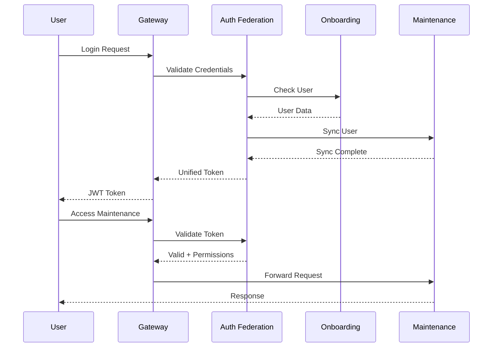

# Portal Integration Architecture
## Wave 3: Secure Integration Between Maintenance and Onboarding Portals

### Table of Contents
1. [Executive Summary](#executive-summary)
2. [Architecture Overview](#architecture-overview)
3. [Integration Components](#integration-components)
4. [API Gateway Design](#api-gateway-design)
5. [Authentication Federation](#authentication-federation)
6. [Data Synchronization Patterns](#data-synchronization-patterns)
7. [Message Queue Architecture](#message-queue-architecture)
8. [Webhook Specifications](#webhook-specifications)
9. [Security Architecture](#security-architecture)
10. [Implementation Roadmap](#implementation-roadmap)

---

## Executive Summary

This document outlines the integration architecture for connecting the SMS Maintenance Portal (SQLite-based) with the SMS Onboarding Portal (PostgreSQL-based) while maintaining security and protecting the hidden revenue model.

### Key Design Principles
- **Separation of Concerns**: Portals remain independent systems
- **Security First**: Revenue model data never exposed
- **Asynchronous Communication**: Event-driven architecture
- **Fault Tolerance**: Resilient to portal downtime
- **Audit Trail**: Complete tracking of all data flows

### Integration Goals
1. Seamless data flow from onboarding to maintenance
2. Unified authentication experience
3. Real-time progress tracking
4. Secure handling of sensitive pricing data
5. Scalable architecture for future growth

---

## Architecture Overview

### High-Level Integration Architecture

```
┌─────────────────────────────────────────────────────────────────────────────┐
│                         SMS Portal Integration Architecture                    │
├─────────────────────────────────────────────────────────────────────────────┤
│                                                                               │
│  ┌─────────────────────┐         ┌─────────────────────┐                    │
│  │  Onboarding Portal  │         │ Maintenance Portal  │                    │
│  │   (PostgreSQL)      │         │    (SQLite)         │                    │
│  └──────────┬──────────┘         └──────────┬──────────┘                    │
│             │                                │                               │
│             ▼                                ▼                               │
│  ┌─────────────────────────────────────────────────────┐                    │
│  │              API Gateway (Kong/Express)              │                    │
│  │  - Authentication Federation                         │                    │
│  │  - Rate Limiting                                   │                    │
│  │  - Request Routing                                 │                    │
│  │  - Revenue Data Filtering                          │                    │
│  └─────────────────────┬───────────────────────────────┘                    │
│                         │                                                     │
│         ┌───────────────┴───────────────┬─────────────────┐                 │
│         ▼                               ▼                 ▼                 │
│  ┌──────────────┐              ┌────────────────┐  ┌──────────────┐        │
│  │ Message Queue│              │  Redis Cache   │  │ Webhook Hub  │        │
│  │ (RabbitMQ)   │              │                │  │              │        │
│  └──────────────┘              └────────────────┘  └──────────────┘        │
│                                                                               │
│  ┌─────────────────────────────────────────────────────────────────────┐    │
│  │                         Data Transformation Layer                     │    │
│  │  - Schema Mapping    - Data Validation    - Revenue Stripping       │    │
│  └─────────────────────────────────────────────────────────────────────┘    │
│                                                                               │
└─────────────────────────────────────────────────────────────────────────────┘
```

### Component Responsibilities

| Component | Primary Function | Technology |
|-----------|-----------------|------------|
| API Gateway | Request routing, auth federation | Kong or Express Gateway |
| Message Queue | Async communication | RabbitMQ |
| Redis Cache | Session storage, temp data | Redis |
| Webhook Hub | Event distribution | Node.js service |
| Data Transformer | Schema translation | Node.js service |

---

## Integration Components

### 1. Integration Service Layer

```javascript
// Integration Service Architecture
const IntegrationService = {
  // Core Services
  services: {
    authentication: {
      type: "Federation Service",
      responsibilities: [
        "Token validation across portals",
        "Single sign-on management",
        "Permission mapping"
      ]
    },
    
    dataSync: {
      type: "Synchronization Service",
      responsibilities: [
        "Data transformation",
        "Conflict resolution",
        "Progress tracking"
      ]
    },
    
    security: {
      type: "Security Filter Service",
      responsibilities: [
        "Revenue data filtering",
        "Access control",
        "Audit logging"
      ]
    },
    
    messaging: {
      type: "Message Service",
      responsibilities: [
        "Event publishing",
        "Queue management",
        "Retry logic"
      ]
    }
  }
};
```

### 2. Data Flow Controllers

```typescript
// Data flow control interfaces
interface DataFlowController {
  // Onboarding to Maintenance flow
  onboardingToMaintenance: {
    trigger: "ONBOARDING_COMPLETE" | "EQUIPMENT_APPROVED",
    processor: "DataTransformationService",
    destination: "MaintenancePortal",
    filters: ["RemoveQualityScores", "StripRevenueData", "MapToSQLiteSchema"]
  },
  
  // Maintenance to Onboarding flow (limited)
  maintenanceToOnboarding: {
    trigger: "TOKEN_REQUESTED" | "STATUS_CHECK",
    processor: "StatusAggregationService",
    destination: "OnboardingPortal",
    filters: ["CompanyVerification", "TokenValidation"]
  }
}
```

### 3. Integration Database Schema

```sql
-- Central integration tracking database
CREATE TABLE integration_jobs (
  id UUID PRIMARY KEY,
  job_type VARCHAR(50) NOT NULL,
  source_system VARCHAR(20) NOT NULL,
  target_system VARCHAR(20) NOT NULL,
  source_id VARCHAR(255) NOT NULL,
  status VARCHAR(20) DEFAULT 'pending',
  payload JSONB NOT NULL,
  filtered_payload JSONB, -- After revenue stripping
  attempt_count INTEGER DEFAULT 0,
  last_attempt TIMESTAMP,
  completed_at TIMESTAMP,
  error_message TEXT,
  created_at TIMESTAMP DEFAULT NOW(),
  updated_at TIMESTAMP DEFAULT NOW()
);

-- Integration audit log
CREATE TABLE integration_audit (
  id UUID PRIMARY KEY,
  job_id UUID REFERENCES integration_jobs(id),
  action VARCHAR(50) NOT NULL,
  actor VARCHAR(100),
  details JSONB,
  ip_address INET,
  created_at TIMESTAMP DEFAULT NOW()
);

-- API key management
CREATE TABLE api_keys (
  id UUID PRIMARY KEY,
  key_hash VARCHAR(255) UNIQUE NOT NULL,
  system_name VARCHAR(50) NOT NULL,
  permissions JSONB NOT NULL,
  rate_limit INTEGER DEFAULT 1000,
  is_active BOOLEAN DEFAULT true,
  last_used TIMESTAMP,
  created_at TIMESTAMP DEFAULT NOW(),
  expires_at TIMESTAMP
);
```

---

## API Gateway Design

### Gateway Architecture

```yaml
# Kong API Gateway Configuration
services:
  - name: onboarding-api
    url: http://onboarding-backend:3002
    routes:
      - name: onboarding-route
        paths:
          - /api/onboarding
        methods: ["GET", "POST", "PUT", "DELETE"]
    plugins:
      - name: jwt
      - name: rate-limiting
        config:
          minute: 100
      - name: correlation-id
      - name: revenue-filter
        config:
          strip_fields:
            - "markup_percentage"
            - "markup_amount"
            - "profit_margin"

  - name: maintenance-api
    url: http://maintenance-backend:3001
    routes:
      - name: maintenance-route
        paths:
          - /api/maintenance
        methods: ["GET", "POST", "PUT", "DELETE"]
    plugins:
      - name: jwt
      - name: rate-limiting
        config:
          minute: 200
      - name: correlation-id
```

### Custom Revenue Filter Plugin

```javascript
// Kong custom plugin for revenue data filtering
class RevenueFilterPlugin {
  constructor(config) {
    this.stripFields = config.strip_fields || [];
    this.protectedEndpoints = [
      '/api/*/parts/pricing',
      '/api/*/purchase-orders',
      '/api/*/revenue-reports'
    ];
  }

  async access(kong) {
    const request = await kong.request.get();
    
    // Check if endpoint contains revenue data
    if (this.isProtectedEndpoint(request.path)) {
      // Verify admin access
      const user = await this.getAuthenticatedUser(kong);
      if (!this.hasRevenueAccess(user)) {
        return kong.response.exit(403, { 
          message: "Access denied to revenue data" 
        });
      }
    }
  }

  async response(kong) {
    const response = await kong.response.get();
    const body = response.body;
    
    if (body && typeof body === 'object') {
      // Strip revenue fields from response
      this.stripRevenueData(body);
      await kong.response.set_body(body);
    }
  }

  stripRevenueData(obj) {
    if (Array.isArray(obj)) {
      obj.forEach(item => this.stripRevenueData(item));
    } else if (obj && typeof obj === 'object') {
      this.stripFields.forEach(field => {
        delete obj[field];
      });
      Object.values(obj).forEach(value => {
        if (typeof value === 'object') {
          this.stripRevenueData(value);
        }
      });
    }
  }
}
```

---

## Authentication Federation

### Federated Authentication Architecture

```typescript
// Authentication federation service
interface FederatedAuthService {
  // Token validation across systems
  validateToken(token: string): Promise<{
    valid: boolean;
    user: User;
    permissions: Permission[];
    systems: string[];
  }>;
  
  // Single sign-on flow
  initiateSSO(system: 'onboarding' | 'maintenance'): {
    authUrl: string;
    state: string;
    nonce: string;
  };
  
  // Permission mapping
  mapPermissions(sourceSystem: string, targetSystem: string, role: string): string[];
}
```

### JWT Token Structure

```javascript
// Unified JWT payload structure
const unifiedJwtPayload = {
  // Standard claims
  sub: "user-uuid",
  iat: 1234567890,
  exp: 1234567890,
  
  // Custom claims
  systems: {
    onboarding: {
      companyId: "company-uuid",
      role: "MANAGER",
      permissions: ["equipment.review", "equipment.approve"]
    },
    maintenance: {
      companyId: 1,
      role: "manager",
      specialization: "mechanical",
      permissions: ["fault.create", "maintenance.approve"]
    }
  },
  
  // Federation metadata
  federation: {
    primarySystem: "onboarding",
    lastSync: "2024-01-01T00:00:00Z",
    syncedSystems: ["maintenance"]
  }
};
```

### Authentication Flow



---

## Data Synchronization Patterns

### 1. Event-Driven Synchronization

```javascript
// Event definitions for portal synchronization
const SyncEvents = {
  // Onboarding events
  VESSEL_ONBOARDED: {
    source: "onboarding",
    target: "maintenance",
    payload: {
      vesselId: "uuid",
      companyId: "uuid",
      equipment: [],
      documents: [],
      timestamp: "ISO-8601"
    }
  },
  
  EQUIPMENT_APPROVED: {
    source: "onboarding",
    target: "maintenance",
    payload: {
      equipmentId: "uuid",
      approvedBy: "uuid",
      qualityScore: 85,
      criticalParts: []
    }
  },
  
  // Maintenance events
  ONBOARDING_TOKEN_REQUESTED: {
    source: "maintenance",
    target: "onboarding",
    payload: {
      companyId: 1,
      vesselId: 1,
      requestedBy: 1
    }
  }
};
```

### 2. Data Transformation Pipeline

```typescript
// Data transformation service
class DataTransformationPipeline {
  private transformers: Map<string, Transformer>;
  
  constructor() {
    this.transformers = new Map([
      ['uuid-to-int', new UuidToIntTransformer()],
      ['enum-mapping', new EnumMappingTransformer()],
      ['revenue-stripper', new RevenueStripperTransformer()],
      ['schema-mapper', new SchemaMapperTransformer()]
    ]);
  }
  
  async transform(data: any, pipeline: string[]): Promise<any> {
    let result = data;
    
    for (const transformerName of pipeline) {
      const transformer = this.transformers.get(transformerName);
      if (transformer) {
        result = await transformer.transform(result);
      }
    }
    
    return result;
  }
}

// Example transformer
class RevenueStripperTransformer implements Transformer {
  private revenueFields = [
    'markup_percentage',
    'markup_amount',
    'unit_cost',
    'total_cost',
    'profit_margin'
  ];
  
  async transform(data: any): Promise<any> {
    const cleaned = JSON.parse(JSON.stringify(data));
    this.stripFields(cleaned);
    return cleaned;
  }
  
  private stripFields(obj: any) {
    if (Array.isArray(obj)) {
      obj.forEach(item => this.stripFields(item));
    } else if (obj && typeof obj === 'object') {
      this.revenueFields.forEach(field => delete obj[field]);
      Object.values(obj).forEach(value => {
        if (typeof value === 'object') {
          this.stripFields(value);
        }
      });
    }
  }
}
```

### 3. Sync State Management

```sql
-- Sync state tracking
CREATE TABLE sync_state (
  id UUID PRIMARY KEY,
  source_system VARCHAR(20) NOT NULL,
  target_system VARCHAR(20) NOT NULL,
  entity_type VARCHAR(50) NOT NULL,
  entity_id VARCHAR(255) NOT NULL,
  source_version INTEGER NOT NULL,
  target_version INTEGER,
  last_sync TIMESTAMP,
  sync_status VARCHAR(20) DEFAULT 'pending',
  sync_errors JSONB,
  created_at TIMESTAMP DEFAULT NOW(),
  updated_at TIMESTAMP DEFAULT NOW(),
  
  UNIQUE(source_system, target_system, entity_type, entity_id)
);

-- Conflict resolution log
CREATE TABLE sync_conflicts (
  id UUID PRIMARY KEY,
  sync_state_id UUID REFERENCES sync_state(id),
  conflict_type VARCHAR(50) NOT NULL,
  source_data JSONB NOT NULL,
  target_data JSONB NOT NULL,
  resolution_strategy VARCHAR(50),
  resolved_data JSONB,
  resolved_by VARCHAR(100),
  resolved_at TIMESTAMP,
  created_at TIMESTAMP DEFAULT NOW()
);
```

---

## Message Queue Architecture

### RabbitMQ Configuration

```javascript
// RabbitMQ topology
const queueTopology = {
  exchanges: {
    'portal.events': {
      type: 'topic',
      durable: true
    },
    'portal.dlx': {
      type: 'fanout',
      durable: true
    }
  },
  
  queues: {
    'onboarding.to.maintenance': {
      durable: true,
      arguments: {
        'x-dead-letter-exchange': 'portal.dlx',
        'x-message-ttl': 3600000, // 1 hour
        'x-max-retries': 3
      }
    },
    'maintenance.to.onboarding': {
      durable: true,
      arguments: {
        'x-dead-letter-exchange': 'portal.dlx',
        'x-message-ttl': 3600000
      }
    },
    'portal.dlq': {
      durable: true
    }
  },
  
  bindings: {
    'portal.events -> onboarding.to.maintenance': {
      pattern: 'onboarding.*'
    },
    'portal.events -> maintenance.to.onboarding': {
      pattern: 'maintenance.*'
    },
    'portal.dlx -> portal.dlq': {}
  }
};
```

### Message Handlers

```typescript
// Message handler implementation
class PortalMessageHandler {
  constructor(
    private transformer: DataTransformationPipeline,
    private syncService: SyncService,
    private auditService: AuditService
  ) {}
  
  async handleOnboardingComplete(message: Message) {
    const { vesselId, companyId, equipment } = message.data;
    
    try {
      // Start integration job
      const jobId = await this.createIntegrationJob({
        type: 'VESSEL_ONBOARDING',
        source: 'onboarding',
        target: 'maintenance',
        payload: message.data
      });
      
      // Transform data
      const transformed = await this.transformer.transform(
        message.data,
        ['revenue-stripper', 'uuid-to-int', 'schema-mapper']
      );
      
      // Sync to maintenance
      await this.syncService.syncVessel(transformed);
      
      // Update job status
      await this.updateIntegrationJob(jobId, 'completed');
      
      // Audit trail
      await this.auditService.log({
        action: 'VESSEL_SYNCED',
        jobId,
        details: { vesselId, equipmentCount: equipment.length }
      });
      
      // Acknowledge message
      message.ack();
      
    } catch (error) {
      // Handle errors with retry logic
      if (message.retryCount < 3) {
        message.retry();
      } else {
        message.reject();
        await this.handleFailedSync(message, error);
      }
    }
  }
}
```

### Dead Letter Queue Handling

```javascript
// DLQ processor for failed messages
class DeadLetterProcessor {
  async processFailedMessage(message: Message) {
    const failure = {
      messageId: message.id,
      exchange: message.exchange,
      routingKey: message.routingKey,
      payload: message.data,
      error: message.error,
      retryCount: message.retryCount,
      timestamp: new Date()
    };
    
    // Store for manual review
    await this.storeFailure(failure);
    
    // Alert administrators
    await this.alertAdmins({
      type: 'SYNC_FAILURE',
      severity: 'HIGH',
      details: failure
    });
    
    // Create manual resolution task
    await this.createResolutionTask(failure);
  }
}
```

---

## Webhook Specifications

### Webhook Configuration

```typescript
// Webhook definitions
interface WebhookConfig {
  // Onboarding webhooks
  onboarding: {
    events: [
      'vessel.created',
      'vessel.onboarding.started',
      'vessel.onboarding.completed',
      'equipment.created',
      'equipment.updated',
      'equipment.approved',
      'equipment.rejected',
      'quality.score.calculated'
    ],
    endpoints: {
      maintenance: 'https://maintenance.sms.com/webhooks/onboarding',
      analytics: 'https://analytics.sms.com/webhooks/events'
    }
  },
  
  // Maintenance webhooks
  maintenance: {
    events: [
      'token.requested',
      'fault.critical',
      'maintenance.overdue',
      'parts.low_stock'
    ],
    endpoints: {
      onboarding: 'https://onboarding.sms.com/webhooks/maintenance',
      notifications: 'https://notify.sms.com/webhooks/alerts'
    }
  }
}
```

### Webhook Payload Structure

```typescript
// Standardized webhook payload
interface WebhookPayload {
  id: string;
  timestamp: string;
  event: string;
  source: {
    system: 'onboarding' | 'maintenance';
    version: string;
  };
  data: {
    entity: string;
    entityId: string;
    changes?: Record<string, any>;
    metadata?: Record<string, any>;
  };
  signature: string; // HMAC-SHA256
}

// Example webhook payload
const webhookExample: WebhookPayload = {
  id: "webhook-123",
  timestamp: "2024-01-01T00:00:00Z",
  event: "equipment.approved",
  source: {
    system: "onboarding",
    version: "1.0.0"
  },
  data: {
    entity: "equipment",
    entityId: "equip-456",
    changes: {
      status: { from: "PENDING_REVIEW", to: "APPROVED" },
      qualityScore: { from: 75, to: 85 }
    },
    metadata: {
      approvedBy: "user-789",
      vesselId: "vessel-123",
      // Revenue data excluded
    }
  },
  signature: "sha256=..."
};
```

### Webhook Security

```javascript
// Webhook signature verification
class WebhookSecurity {
  private secret: string;
  
  generateSignature(payload: any): string {
    const hmac = crypto.createHmac('sha256', this.secret);
    hmac.update(JSON.stringify(payload));
    return `sha256=${hmac.digest('hex')}`;
  }
  
  verifySignature(payload: any, signature: string): boolean {
    const expected = this.generateSignature(payload);
    return crypto.timingSafeEqual(
      Buffer.from(expected),
      Buffer.from(signature)
    );
  }
  
  async deliverWebhook(endpoint: string, payload: WebhookPayload) {
    const signature = this.generateSignature(payload);
    
    const response = await fetch(endpoint, {
      method: 'POST',
      headers: {
        'Content-Type': 'application/json',
        'X-Webhook-Signature': signature,
        'X-Webhook-Id': payload.id,
        'X-Webhook-Timestamp': payload.timestamp
      },
      body: JSON.stringify(payload)
    });
    
    if (!response.ok) {
      throw new WebhookDeliveryError(
        `Failed to deliver webhook: ${response.status}`
      );
    }
  }
}
```

---

## Security Architecture

### Security Layers

```
┌─────────────────────────────────────────────────────────────────┐
│                    Security Architecture                         │
├─────────────────────────────────────────────────────────────────┤
│                                                                  │
│  Layer 1: Network Security                                       │
│  ┌─────────────────────────────────────────────────────────┐   │
│  │ - TLS 1.3 for all communications                        │   │
│  │ - VPN tunnel between data centers                       │   │
│  │ - IP whitelisting for critical endpoints                │   │
│  └─────────────────────────────────────────────────────────┘   │
│                                                                  │
│  Layer 2: Application Security                                   │
│  ┌─────────────────────────────────────────────────────────┐   │
│  │ - JWT with short expiration                             │   │
│  │ - API key rotation                                      │   │
│  │ - Rate limiting per endpoint                            │   │
│  └─────────────────────────────────────────────────────────┘   │
│                                                                  │
│  Layer 3: Data Security                                          │
│  ┌─────────────────────────────────────────────────────────┐   │
│  │ - Revenue data filtering at gateway                     │   │
│  │ - Encryption at rest (AES-256)                         │   │
│  │ - Field-level encryption for sensitive data            │   │
│  └─────────────────────────────────────────────────────────┘   │
│                                                                  │
│  Layer 4: Audit & Compliance                                     │
│  ┌─────────────────────────────────────────────────────────┐   │
│  │ - Complete audit trail                                  │   │
│  │ - GDPR compliance                                       │   │
│  │ - Regular security audits                               │   │
│  └─────────────────────────────────────────────────────────┘   │
│                                                                  │
└─────────────────────────────────────────────────────────────────┘
```

### Revenue Model Protection

```javascript
// Revenue data protection service
class RevenueProtectionService {
  private revenuePatterns = [
    /markup/i,
    /profit/i,
    /margin/i,
    /revenue/i,
    /pricing/i,
    /cost.*internal/i
  ];
  
  private adminOnlyEndpoints = [
    '/api/reports/revenue',
    '/api/parts/pricing',
    '/api/analytics/profitability'
  ];
  
  async filterResponse(data: any, userRole: string): Promise<any> {
    if (userRole === 'SMS_ADMIN') {
      return data; // Full access
    }
    
    // Deep clone to avoid mutations
    const filtered = JSON.parse(JSON.stringify(data));
    this.removeRevenueFields(filtered);
    return filtered;
  }
  
  private removeRevenueFields(obj: any) {
    if (Array.isArray(obj)) {
      obj.forEach(item => this.removeRevenueFields(item));
    } else if (obj && typeof obj === 'object') {
      Object.keys(obj).forEach(key => {
        if (this.isRevenueField(key)) {
          delete obj[key];
        } else if (typeof obj[key] === 'object') {
          this.removeRevenueFields(obj[key]);
        }
      });
    }
  }
  
  private isRevenueField(fieldName: string): boolean {
    return this.revenuePatterns.some(pattern => 
      pattern.test(fieldName)
    );
  }
}
```

### Access Control Matrix

```typescript
// Role-based access control for integration
const AccessControlMatrix = {
  // System roles
  SMS_ADMIN: {
    systems: ['onboarding', 'maintenance', 'integration'],
    data: ['all'],
    revenue: true
  },
  
  COMPANY_ADMIN: {
    systems: ['onboarding', 'maintenance'],
    data: ['company_owned'],
    revenue: false
  },
  
  MANAGER: {
    systems: ['onboarding', 'maintenance'],
    data: ['vessel_assigned', 'read_only_others'],
    revenue: false
  },
  
  TECHNICIAN: {
    systems: ['maintenance', 'onboarding_mobile'],
    data: ['equipment_assigned'],
    revenue: false
  },
  
  // Integration-specific permissions
  INTEGRATION_SERVICE: {
    systems: ['all'],
    data: ['transform_only'],
    revenue: false,
    special: ['data_transformation', 'sync_management']
  }
};
```

---

## Implementation Roadmap

### Phase 1: Foundation (Weeks 1-2)

#### Infrastructure Setup
- [ ] Deploy API Gateway (Kong or custom Express)
- [ ] Set up RabbitMQ message broker
- [ ] Configure Redis for caching/sessions
- [ ] Create integration database schema
- [ ] Implement audit logging system

#### Basic Integration
- [ ] Token validation service
- [ ] Simple data transformation pipeline
- [ ] Basic webhook delivery system
- [ ] Health monitoring endpoints

### Phase 2: Core Integration (Weeks 3-4)

#### Authentication Federation
- [ ] Unified JWT structure
- [ ] Cross-system token validation
- [ ] Permission mapping service
- [ ] Single sign-on implementation

#### Data Synchronization
- [ ] Event-driven sync handlers
- [ ] Data transformation rules
- [ ] Revenue data filtering
- [ ] Conflict resolution logic

### Phase 3: Advanced Features (Weeks 5-6)

#### Message Queue Integration
- [ ] Full RabbitMQ topology
- [ ] Retry logic implementation
- [ ] Dead letter queue handling
- [ ] Performance optimization

#### Security Hardening
- [ ] Complete revenue protection
- [ ] Field-level encryption
- [ ] API rate limiting
- [ ] Security audit tools

### Phase 4: Production Readiness (Weeks 7-8)

#### Monitoring & Operations
- [ ] Comprehensive logging
- [ ] Performance metrics
- [ ] Alert system
- [ ] Backup procedures

#### Documentation & Training
- [ ] API documentation
- [ ] Integration guides
- [ ] Security procedures
- [ ] Admin training

### Implementation Checklist

```markdown
## Pre-Implementation Requirements
- [ ] Security review completed
- [ ] Infrastructure provisioned
- [ ] API specifications approved
- [ ] Data mapping documented
- [ ] Test environments ready

## Development Milestones
- [ ] Week 1-2: Infrastructure and basic integration
- [ ] Week 3-4: Core features and authentication
- [ ] Week 5-6: Advanced features and security
- [ ] Week 7-8: Testing and production prep

## Testing Requirements
- [ ] Unit tests (>80% coverage)
- [ ] Integration tests
- [ ] Security penetration testing
- [ ] Performance load testing
- [ ] Failover testing

## Deployment Steps
- [ ] Stage 1: Deploy to development
- [ ] Stage 2: Internal testing
- [ ] Stage 3: Limited production rollout
- [ ] Stage 4: Full production deployment
```

### Success Metrics

```javascript
// Key performance indicators
const IntegrationKPIs = {
  performance: {
    syncLatency: "< 5 seconds",
    messageProcessing: "> 1000/minute",
    apiResponseTime: "< 200ms p95",
    errorRate: "< 0.1%"
  },
  
  reliability: {
    uptime: "99.9%",
    dataConsistency: "100%",
    messageDelivery: "99.99%",
    failoverTime: "< 30 seconds"
  },
  
  security: {
    unauthorizedAccess: "0 incidents",
    dataLeaks: "0 incidents",
    auditCompliance: "100%",
    revenueProtection: "100%"
  }
};
```

---

## Conclusion

This integration architecture provides a secure, scalable foundation for connecting the SMS Maintenance and Onboarding portals while protecting sensitive revenue data. The event-driven design ensures loose coupling between systems, while the comprehensive security measures protect the business model.

Key benefits:
- **Security First**: Revenue data never exposed to clients
- **Scalable Design**: Can handle growth without redesign
- **Fault Tolerant**: Continues operating despite failures
- **Audit Complete**: Full tracking of all operations
- **Future Ready**: Extensible for new requirements

The phased implementation approach ensures each component is properly tested before moving to the next phase, reducing risk and ensuring a successful integration.