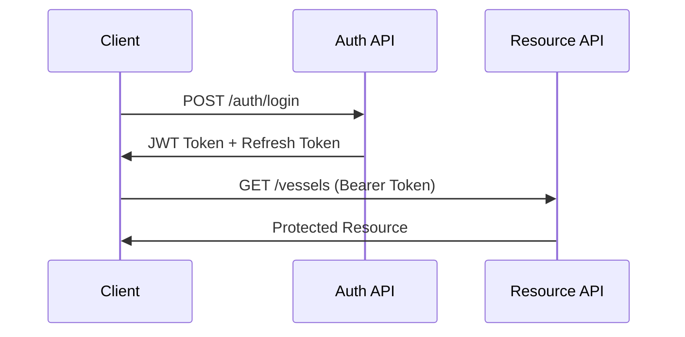

# Unified API Specification for SMS Portal Integration

## Table of Contents
1. [Overview](#overview)
2. [API Design Principles](#api-design-principles)
3. [Authentication & Security](#authentication--security)
4. [API Standards](#api-standards)
5. [Unified Endpoints](#unified-endpoints)
6. [Integration Patterns](#integration-patterns)
7. [Rate Limiting & Throttling](#rate-limiting--throttling)
8. [Error Handling](#error-handling)
9. [Versioning Strategy](#versioning-strategy)
10. [OpenAPI Specifications](#openapi-specifications)
11. [Security Guidelines](#security-guidelines)
12. [Integration Examples](#integration-examples)

## Overview

This document defines the unified API specification for integrating the SMS Onboarding Portal with the Maintenance Portal. The API design ensures consistency, security, and scalability while protecting revenue-sensitive endpoints.

### Core Objectives
- **Consistency**: Unified patterns across both systems
- **Security**: Revenue-sensitive data protection
- **Performance**: Optimized for real-time operations
- **Reliability**: Built-in redundancy and error handling
- **Scalability**: Designed for growth

## API Design Principles

### RESTful Standards
1. **Resource-Oriented Design**
   - Nouns for resources: `/vessels`, `/equipment`, `/parts`
   - HTTP verbs for actions: GET, POST, PUT, PATCH, DELETE
   - Nested resources: `/vessels/{id}/equipment`

2. **Stateless Operations**
   - No server-side session state
   - Complete information in each request
   - JWT tokens for authentication

3. **Idempotency**
   - Safe methods: GET, HEAD, OPTIONS
   - Idempotent methods: PUT, DELETE
   - Request IDs for POST operations

### Naming Conventions

#### URL Structure
```
https://api.{portal}.sms.com/v{version}/{resource}
```

#### Resource Naming
- Plural nouns: `/vessels`, `/users`, `/companies`
- Kebab-case for multi-word: `/vessel-types`, `/critical-parts`
- Clear hierarchies: `/vessels/{vesselId}/equipment/{equipmentId}`

#### Query Parameters
- camelCase: `pageSize`, `sortOrder`, `includeDeleted`
- Boolean flags without values: `?active&verified`
- Arrays with brackets: `status[]=active&status[]=pending`

## Authentication & Security

### JWT Token Structure
```json
{
  "sub": "user-uuid",
  "email": "user@example.com",
  "role": "MANAGER",
  "companyId": "company-uuid",
  "permissions": ["vessel.read", "equipment.write"],
  "iat": 1234567890,
  "exp": 1234567890,
  "jti": "unique-token-id"
}
```

### Authentication Flow


### Token Management
1. **Access Token**: 15 minutes TTL
2. **Refresh Token**: 7 days TTL
3. **Token Rotation**: New refresh token on each use
4. **Blacklisting**: Revoked tokens cached in Redis

## API Standards

### Request Format

#### Headers
```http
Content-Type: application/json
Accept: application/json
Authorization: Bearer {jwt-token}
X-Request-ID: {uuid}
X-Client-Version: 1.0.0
```

#### Request Body
```json
{
  "data": {
    "type": "equipment",
    "attributes": {
      "name": "Main Engine",
      "manufacturer": "MAN B&W"
    }
  }
}
```

### Response Format

#### Success Response
```json
{
  "data": {
    "id": "uuid",
    "type": "equipment",
    "attributes": {
      "name": "Main Engine",
      "status": "operational"
    },
    "relationships": {
      "vessel": {
        "data": { "type": "vessel", "id": "vessel-uuid" }
      }
    }
  },
  "meta": {
    "timestamp": "2025-01-05T12:00:00Z",
    "version": "1.0"
  }
}
```

#### List Response with Pagination
```json
{
  "data": [...],
  "pagination": {
    "page": 1,
    "pageSize": 25,
    "totalPages": 10,
    "totalCount": 250
  },
  "links": {
    "self": "/vessels?page=1",
    "first": "/vessels?page=1",
    "last": "/vessels?page=10",
    "next": "/vessels?page=2"
  }
}
```

## Unified Endpoints

### Core Resource Endpoints

#### Companies
```yaml
/v1/companies:
  GET:    List companies (filtered access)
  POST:   Create company (ADMIN only)
  
/v1/companies/{companyId}:
  GET:    Get company details
  PATCH:  Update company
  DELETE: Soft delete company (ADMIN only)
```

#### Vessels
```yaml
/v1/vessels:
  GET:    List vessels with filtering
  POST:   Create vessel
  
/v1/vessels/{vesselId}:
  GET:    Get vessel details
  PATCH:  Update vessel
  DELETE: Soft delete vessel
  
/v1/vessels/{vesselId}/status:
  GET:    Get vessel operational status
  PATCH:  Update vessel status
```

#### Equipment
```yaml
/v1/equipment:
  GET:    List all equipment
  
/v1/vessels/{vesselId}/equipment:
  GET:    List vessel equipment
  POST:   Add equipment to vessel
  
/v1/equipment/{equipmentId}:
  GET:    Get equipment details
  PATCH:  Update equipment
  DELETE: Remove equipment
  
/v1/equipment/{equipmentId}/verify:
  POST:   Verify equipment (MANAGER only)
```

#### Parts & Inventory
```yaml
/v1/parts:
  GET:    Search parts catalog
  POST:   Add part to catalog
  
/v1/equipment/{equipmentId}/parts:
  GET:    List equipment parts
  POST:   Link part to equipment
  
/v1/parts/{partId}:
  GET:    Get part details
  PATCH:  Update part info
  
/v1/parts/{partId}/inventory:
  GET:    Get inventory levels
  PATCH:  Update stock levels
  
/v1/parts/cross-reference:
  POST:   Find alternative parts
```

### Integration Endpoints

#### Data Synchronization
```yaml
/v1/sync/export:
  POST:   Export data to maintenance portal
  Body:
    - vesselId: UUID
    - exportType: full|incremental|specific
    - includeAttachments: boolean
    - format: json|xml|csv
    
/v1/sync/import:
  POST:   Import data from maintenance portal
  Body:
    - source: maintenance|onboarding
    - dataType: vessels|equipment|parts
    - mergeStrategy: overwrite|merge|skip
    
/v1/sync/status/{jobId}:
  GET:    Check sync job status
```

#### Webhooks
```yaml
/v1/webhooks/register:
  POST:   Register webhook endpoint
  Body:
    - url: https://example.com/webhook
    - events: [equipment.created, vessel.verified]
    - secret: shared-secret
    
/v1/webhooks/{webhookId}:
  GET:    Get webhook details
  PATCH:  Update webhook config
  DELETE: Unregister webhook
  
/v1/webhooks/{webhookId}/test:
  POST:   Send test event
```

### Analytics & Reporting
```yaml
/v1/analytics/quality-scores:
  GET:    Quality score metrics
  Query:
    - vesselId: UUID
    - dateFrom: ISO8601
    - dateTo: ISO8601
    - groupBy: vessel|equipment|technician
    
/v1/analytics/onboarding-progress:
  GET:    Onboarding completion metrics
  
/v1/analytics/inventory-health:
  GET:    Parts inventory analysis
```

## Integration Patterns

### Event-Driven Integration
```yaml
Events:
  # Onboarding Events
  - vessel.onboarding.started
  - vessel.onboarding.completed
  - equipment.added
  - equipment.verified
  - parts.linked
  
  # Maintenance Events
  - maintenance.scheduled
  - maintenance.completed
  - fault.reported
  - fault.resolved
  
  # Inventory Events
  - inventory.low_stock
  - inventory.reorder_triggered
  - parts.received
```

### Batch Operations
```yaml
/v1/batch:
  POST:   Execute batch operations
  Body:
    operations:
      - method: POST
        url: /equipment
        body: {...}
      - method: PATCH
        url: /equipment/{id}
        body: {...}
```

### File Handling
```yaml
/v1/files/upload:
  POST:   Upload file
  Headers:
    Content-Type: multipart/form-data
  Body:
    - file: binary
    - metadata: JSON
    
/v1/files/{fileId}:
  GET:    Get file metadata
  DELETE: Delete file
  
/v1/files/{fileId}/download:
  GET:    Download file (returns presigned URL)
```

## Rate Limiting & Throttling

### Rate Limit Tiers

| Tier | Requests/Hour | Burst | Target Users |
|------|--------------|-------|--------------|
| Anonymous | 100 | 20 | Unauthenticated |
| Basic | 1,000 | 100 | Technicians |
| Standard | 5,000 | 500 | Managers |
| Premium | 20,000 | 2,000 | Admins |
| Service | 100,000 | 10,000 | System Integration |

### Rate Limit Headers
```http
X-RateLimit-Limit: 1000
X-RateLimit-Remaining: 999
X-RateLimit-Reset: 1234567890
X-RateLimit-Retry-After: 60
```

### Endpoint-Specific Limits
```yaml
/auth/login: 5 per 15 minutes per IP
/auth/register: 3 per hour per IP
/files/upload: 10 per minute per user
/sync/export: 10 per hour per company
/batch: 5 per minute per user
```

## Error Handling

### Error Response Format
```json
{
  "error": {
    "code": "VALIDATION_ERROR",
    "message": "Invalid input data",
    "details": [
      {
        "field": "equipment.name",
        "code": "REQUIRED",
        "message": "Equipment name is required"
      }
    ],
    "meta": {
      "timestamp": "2025-01-05T12:00:00Z",
      "requestId": "req-uuid",
      "documentation": "https://docs.sms.com/errors/VALIDATION_ERROR"
    }
  }
}
```

### Standard Error Codes

| HTTP Status | Error Code | Description |
|-------------|------------|-------------|
| 400 | VALIDATION_ERROR | Invalid request data |
| 401 | UNAUTHORIZED | Missing or invalid auth |
| 403 | FORBIDDEN | Insufficient permissions |
| 404 | NOT_FOUND | Resource not found |
| 409 | CONFLICT | Resource conflict |
| 429 | RATE_LIMITED | Too many requests |
| 500 | INTERNAL_ERROR | Server error |
| 503 | SERVICE_UNAVAILABLE | Temporary unavailable |

## Versioning Strategy

### URL Versioning
- Major versions in URL: `/v1/`, `/v2/`
- Breaking changes require new major version
- Non-breaking additions allowed in same version

### Version Lifecycle
1. **Alpha**: `/v2-alpha/` - Experimental
2. **Beta**: `/v2-beta/` - Testing phase
3. **Stable**: `/v2/` - Production ready
4. **Deprecated**: Sunset headers sent
5. **Retired**: Returns 410 Gone

### Deprecation Headers
```http
Sunset: Sat, 31 Dec 2025 23:59:59 GMT
Deprecation: true
Link: <https://api.sms.com/v2/vessels>; rel="successor-version"
```

## OpenAPI Specifications

### Onboarding Portal API
```yaml
openapi: 3.1.0
info:
  title: SMS Onboarding Portal API
  version: 1.0.0
  description: API for vessel onboarding and equipment documentation
  
servers:
  - url: https://api.onboarding.sms.com/v1
    description: Production
  - url: https://staging-api.onboarding.sms.com/v1
    description: Staging
    
security:
  - bearerAuth: []
  
paths:
  /vessels:
    get:
      summary: List vessels
      parameters:
        - $ref: '#/components/parameters/pagination'
        - name: status
          in: query
          schema:
            type: string
            enum: [active, onboarding, inactive]
      responses:
        200:
          $ref: '#/components/responses/VesselList'
```

### Maintenance Portal API
```yaml
openapi: 3.1.0
info:
  title: SMS Maintenance Portal API
  version: 1.0.0
  description: API for vessel maintenance and operations
  
servers:
  - url: https://api.maintenance.sms.com/v1
    description: Production
    
paths:
  /maintenance/schedules:
    get:
      summary: Get maintenance schedules
      security:
        - bearerAuth: []
        - apiKey: []
      responses:
        200:
          $ref: '#/components/responses/MaintenanceSchedules'
```

## Security Guidelines

### Revenue Protection

#### Sensitive Endpoints
```yaml
Protected Resources:
  - /billing/*
  - /contracts/*
  - /pricing/*
  - /revenue-reports/*
  
Access Control:
  - Role-based: ADMIN, FINANCE_MANAGER
  - IP whitelist for billing endpoints
  - Additional MFA for financial operations
  - Audit logging for all access
```

#### Data Masking
```json
{
  "contract": {
    "id": "contract-123",
    "value": "***REDACTED***",
    "maskedValue": "$XX,XXX.00",
    "hasAccess": false
  }
}
```

### API Security Best Practices

1. **Authentication**
   - JWT with short expiration
   - Refresh token rotation
   - Device fingerprinting
   - Session binding

2. **Authorization**
   - Fine-grained permissions
   - Resource-level access control
   - Dynamic permission evaluation
   - Principle of least privilege

3. **Data Protection**
   - TLS 1.3 minimum
   - Field-level encryption
   - PII data masking
   - Secure key management

4. **Audit & Monitoring**
   - Request/response logging
   - Security event tracking
   - Anomaly detection
   - Real-time alerting

### Webhook Security
```yaml
Signature Validation:
  Algorithm: HMAC-SHA256
  Header: X-Webhook-Signature
  Payload: timestamp + "." + request_body
  
Replay Protection:
  - Timestamp validation (5 minute window)
  - Nonce tracking
  - Idempotency keys
```

## Integration Examples

### Example 1: Vessel Onboarding to Maintenance

```bash
# 1. Complete vessel onboarding
POST /v1/vessels/{vesselId}/complete-onboarding
Authorization: Bearer {token}

# 2. Export to maintenance portal
POST /v1/sync/export
{
  "vesselId": "vessel-uuid",
  "targetSystem": "maintenance",
  "exportType": "full",
  "includeAttachments": true
}

# 3. Maintenance portal receives webhook
POST https://maintenance.sms.com/webhooks/receive
X-Webhook-Signature: {signature}
{
  "event": "vessel.imported",
  "vesselId": "vessel-uuid",
  "timestamp": "2025-01-05T12:00:00Z"
}
```

### Example 2: Parts Cross-Reference

```bash
# Search for alternative parts
POST /v1/parts/cross-reference
{
  "partNumber": "MAN-123456",
  "manufacturer": "MAN B&W",
  "equipmentType": "ENGINE"
}

# Response
{
  "data": {
    "originalPart": {
      "id": "part-123",
      "partNumber": "MAN-123456"
    },
    "alternatives": [
      {
        "id": "part-456",
        "partNumber": "WAR-789012",
        "manufacturer": "Wartsila",
        "compatibility": 95,
        "priceRatio": 0.85
      }
    ]
  }
}
```

### Example 3: Batch Equipment Update

```bash
POST /v1/batch
{
  "operations": [
    {
      "method": "PATCH",
      "url": "/equipment/equip-1",
      "body": {
        "status": "maintenance"
      }
    },
    {
      "method": "POST",
      "url": "/equipment/equip-1/parts",
      "body": {
        "partId": "part-789",
        "quantity": 2
      }
    }
  ]
}
```

### Example 4: Real-time Sync with Conflict Resolution

```bash
# Push offline changes
POST /v1/sync/push
{
  "changes": [
    {
      "id": "change-1",
      "entityType": "equipment",
      "entityId": "equip-123",
      "action": "update",
      "data": {
        "status": "operational"
      },
      "version": 5,
      "timestamp": "2025-01-05T11:00:00Z"
    }
  ]
}

# Conflict response
{
  "conflicts": [
    {
      "changeId": "change-1",
      "serverVersion": 6,
      "clientVersion": 5,
      "resolution": "manual_required"
    }
  ]
}
```

## Monitoring & Analytics

### API Metrics
```yaml
Metrics to Track:
  - Request rate by endpoint
  - Response time percentiles (p50, p95, p99)
  - Error rate by type
  - Authentication failures
  - Rate limit violations
  - Webhook delivery success
  
Dashboards:
  - Real-time API health
  - User activity patterns
  - Integration performance
  - Security incidents
```

### Health Check Endpoints
```yaml
/v1/health:
  GET: Basic health check
  Response:
    status: healthy|degraded|unhealthy
    
/v1/health/detailed:
  GET: Detailed system status
  Response:
    database: connected
    redis: connected
    s3: accessible
    integrations:
      maintenance: reachable
      webhooks: operational
```

## Implementation Checklist

### Phase 1: Foundation
- [ ] Define OpenAPI schemas for both portals
- [ ] Implement authentication service
- [ ] Set up rate limiting infrastructure
- [ ] Create error handling framework

### Phase 2: Core APIs
- [ ] Implement vessel management endpoints
- [ ] Build equipment CRUD operations
- [ ] Create parts inventory APIs
- [ ] Add file handling services

### Phase 3: Integration
- [ ] Develop sync endpoints
- [ ] Implement webhook system
- [ ] Build batch operation handlers
- [ ] Create event streaming

### Phase 4: Security & Monitoring
- [ ] Add revenue protection layers
- [ ] Implement audit logging
- [ ] Set up monitoring dashboards
- [ ] Create security scanners

### Phase 5: Documentation & Testing
- [ ] Generate API documentation
- [ ] Create integration guides
- [ ] Build SDK examples
- [ ] Perform security audit

## Conclusion

This unified API specification provides a robust foundation for integrating the SMS Onboarding and Maintenance portals. The design ensures consistency, security, and scalability while protecting revenue-sensitive operations. Regular reviews and updates will keep the API aligned with evolving business needs.