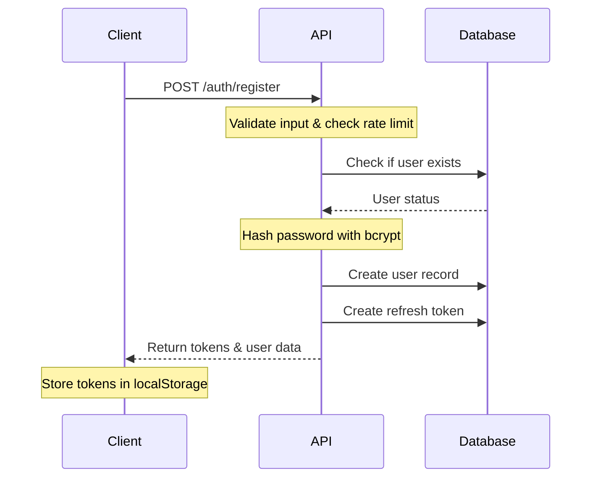
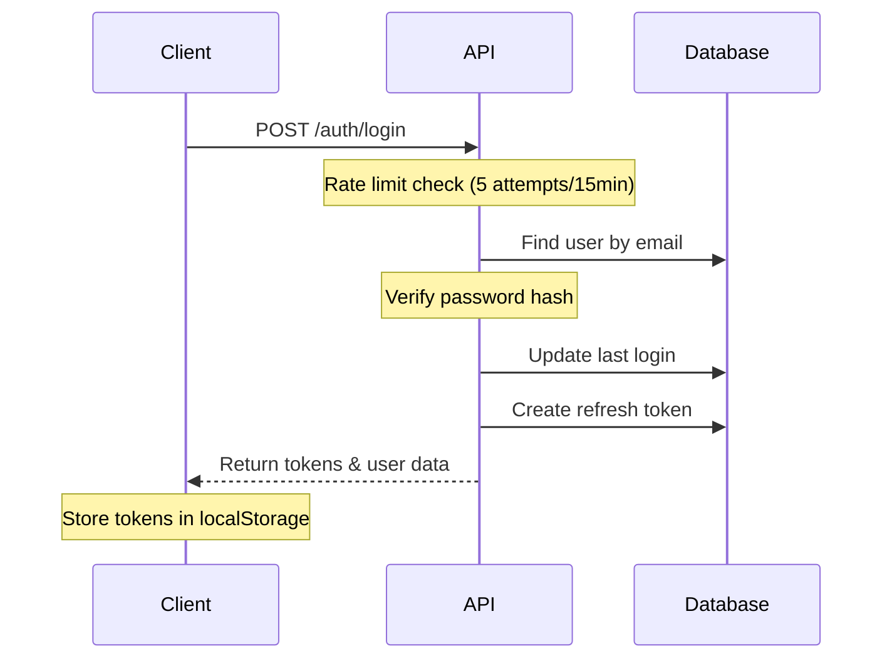
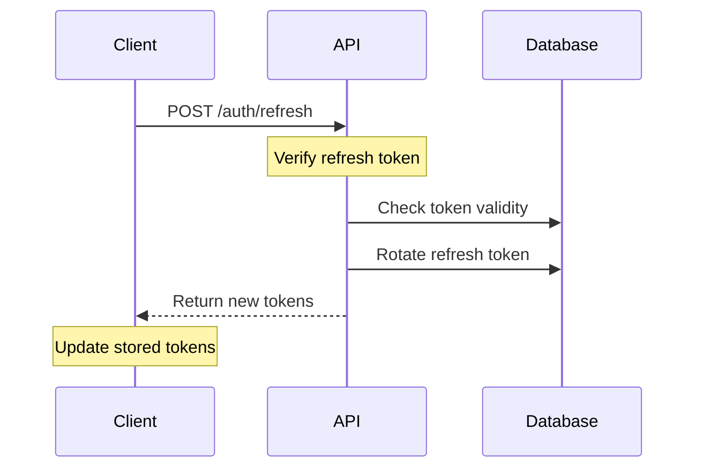
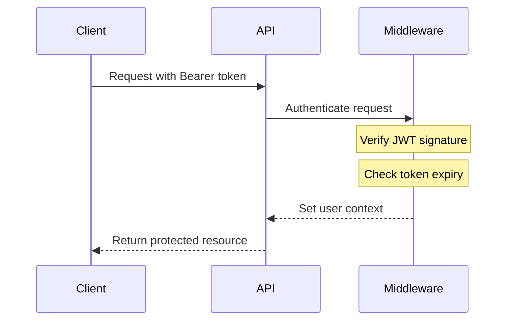

# Authentication Flow Documentation

## Overview

The SMS Onboarding Portal implements a secure JWT-based authentication system with refresh tokens, role-based access control (RBAC), and offline capability support.

## Key Features

- **JWT Token Implementation** with access and refresh tokens
- **Role-Based Access Control** (RBAC) with 5 roles: SUPER_ADMIN, ADMIN, MANAGER, TECHNICIAN, HSE_OFFICER
- **Password Security** using bcrypt with configurable rounds
- **Session Management** with automatic cleanup of expired tokens
- **Rate Limiting** to prevent brute force attacks
- **Offline Support** with localStorage token persistence

## Authentication Flow

### 1. User Registration



### 2. User Login



### 3. Token Refresh



### 4. Protected Route Access



## User Roles and Permissions

### Role Hierarchy

1. **SUPER_ADMIN**: Full system access
2. **ADMIN**: Company management, user management, full vessel access
3. **MANAGER**: Vessel management, analytics, token management
4. **TECHNICIAN**: Equipment management, document uploads
5. **HSE_OFFICER**: Safety documentation, equipment viewing, safety reports

### Permission Matrix

| Permission | SUPER_ADMIN | ADMIN | MANAGER | TECHNICIAN | HSE_OFFICER |
|------------|-------------|--------|----------|-------------|-------------|
| manage_company | ✓ | ✓ | ✗ | ✗ | ✗ |
| manage_users | ✓ | ✓ | ✗ | ✗ | ✗ |
| manage_vessels | ✓ | ✓ | ✓ | ✗ | ✗ |
| view_analytics | ✓ | ✓ | ✓ | ✗ | ✓ |
| export_data | ✓ | ✓ | ✓ | ✗ | ✗ |
| manage_tokens | ✓ | ✓ | ✓ | ✗ | ✗ |
| add_equipment | ✓ | ✓ | ✓ | ✓ | ✗ |
| edit_equipment | ✓ | ✓ | ✓ | ✓ | ✗ |
| view_equipment | ✓ | ✓ | ✓ | ✓ | ✓ |
| upload_documents | ✓ | ✓ | ✓ | ✓ | ✗ |
| manage_safety_documents | ✓ | ✓ | ✗ | ✗ | ✓ |
| view_safety_reports | ✓ | ✓ | ✗ | ✗ | ✓ |
| export_safety_data | ✓ | ✓ | ✗ | ✗ | ✓ |

## Security Features

### Password Requirements

- Minimum 8 characters
- At least one uppercase letter
- At least one lowercase letter
- At least one number
- At least one special character (@$!%*?&)

### Token Security

- **Access Token**: 7-day expiry (configurable)
- **Refresh Token**: 30-day expiry (configurable)
- **Token Rotation**: New refresh token issued on each refresh
- **Secure Storage**: HttpOnly cookies recommended for production

### Rate Limiting

- **Login**: 5 attempts per 15 minutes per IP/email
- **Registration**: 3 attempts per hour per IP
- **Password Reset**: 3 attempts per hour per IP/email
- **API Calls**: Dynamic based on user role

### Session Management

- Automatic cleanup of expired tokens (hourly)
- Revoke all sessions on password change
- Track session metadata (IP, user agent, last used)

## Frontend Implementation

### Auth Service (`/frontend/src/services/auth.ts`)

```typescript
// Initialize auth service
const authService = new AuthService();

// Login
const response = await authService.login({
  email: 'user@example.com',
  password: 'password',
  rememberMe: true
});

// Auto token refresh via axios interceptors
// Tokens automatically attached to requests
```

### Auth Hook (`/frontend/src/hooks/useAuth.ts`)

```typescript
// Use in components
const { 
  user, 
  isAuthenticated, 
  login, 
  logout, 
  hasRole, 
  hasPermission 
} = useAuth();

// Check permissions
if (hasPermission('manage_vessels')) {
  // Show vessel management UI
}
```

### Protected Routes

```typescript
// Route protection
<ProtectedRoute>
  <DashboardLayout />
</ProtectedRoute>

// Role-based protection
<RoleGuard allowedRoles={[UserRole.ADMIN, UserRole.MANAGER]}>
  <AdminPanel />
</RoleGuard>
```

## Offline Support

### Token Storage

- Tokens stored in localStorage for offline access
- Automatic token refresh on app launch
- Graceful degradation when offline

### Sync Queue

- Failed requests queued for retry
- Automatic sync when connection restored
- Conflict resolution for offline changes

## Demo Mode

### Demo Credentials

- **Admin**: admin@demo.com / Demo123!
- **Manager**: manager@demo.com / Demo123!
- **Technician**: tech@demo.com / Demo123!
- **HSE Officer**: hse@demo.com / Demo123!

### Demo Features

- In-memory user storage
- No database required
- Full feature access
- Data persists during session

## API Endpoints

### Authentication Endpoints

- `POST /auth/register` - User registration
- `POST /auth/login` - User login
- `POST /auth/refresh` - Refresh access token
- `POST /auth/logout` - Logout and revoke tokens
- `GET /auth/me` - Get current user
- `PATCH /auth/me` - Update current user
- `POST /auth/change-password` - Change password
- `POST /auth/forgot-password` - Request password reset
- `POST /auth/reset-password` - Reset password with token

## Environment Configuration

```env
# Authentication
JWT_SECRET=your-super-secret-jwt-key
JWT_REFRESH_SECRET=your-super-secret-refresh-key
ACCESS_TOKEN_EXPIRES_IN=7d
REFRESH_TOKEN_EXPIRES_IN=30d
BCRYPT_ROUNDS=10

# Demo Mode
DEMO_MODE=true
```

## Best Practices

1. **Never expose sensitive tokens in logs**
2. **Use HTTPS in production**
3. **Implement CSRF protection for cookie-based auth**
4. **Regular security audits**
5. **Monitor failed login attempts**
6. **Implement account lockout after repeated failures**
7. **Use secure password reset links with expiry**
8. **Log security events for audit trail**